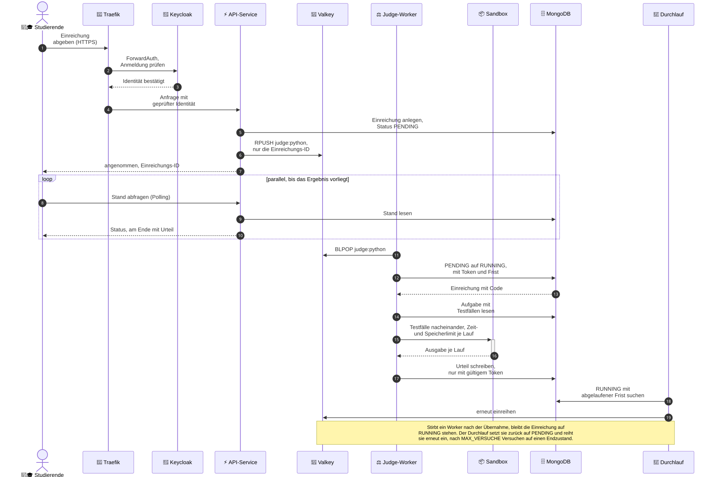

# Online-Judge-Cloud

## Problem

Programmieraufgaben von Hand zu korrigieren skaliert nicht. Bei mehreren
hundert Einreichungen je Aufgabe entscheidet die Korrekturkapazität
darüber, wie oft Studierende überhaupt abgeben dürfen.

Der Online Judge führt eingereichten Code automatisch gegen hinterlegte
Testfälle aus und gibt das Ergebnis zurück.

Zwei Eigenschaften der Domäne prägen die Infrastruktur. Die Last ist
stoßweise: Der Judge wird in Prüfungen eingesetzt. Während einer Klausur
arbeitet ein ganzer Kurs im selben Zeitfenster, zwischen den
Prüfungsterminen liegt der Betrieb nahe null. Und der ausgeführte Code
ist fremd: Endlosschleifen, Speicherfresser und Zugriffsversuche auf das
Netz sind der Normalfall, nicht die Ausnahme.

Über Container-Images bekommt jede Sprache (Python, C++, Java, Rust) ihre
eigene schlanke Laufzeitumgebung, ohne den Host-Worker mit Abhängigkeiten zu
überladen.

## Architektur

Terraform legt die VMs im Kursprojekt an, Ansible rollt darauf mit der
k3s-Rolle den Cluster aus. Die sechs VMs verteilen sich auf drei
Rollen. Der Server trägt die Steuerung und nimmt sonst nur Addons auf,
drei Dienste-Nodes tragen MongoDB, Valkey, Keycloak und die API, zwei
Judge-Nodes führen eingereichten Code aus. Von außen führt ein
einziger Weg hinein: Die DNS-Zone zeigt auf die öffentliche IPv6 der
Nodes, dort nimmt Traefik jede Anfrage entgegen und lässt sie erst
nach geprüfter Anmeldung zur API durch.

### Aufbau

<!-- Quellen der Diagramme: docs/diagramme/*.mmd, von Hand gepflegt, ein
     Generator kann den Datenfluss nicht aus den Manifesten ableiten.
     Nach einer Änderung scripts/diagramme.sh laufen lassen und die SVGs
     mitcommitten. -->



Die dicken Pfeile sind der Weg einer Einreichung, die gestrichelten
sind alles darum herum: Provisionierung, Anmeldung, Skalierung und
Rückholung. Terraform und Ansible laufen von außen und sind zur
Laufzeit nicht beteiligt.

### Datenfluss einer Einreichung



Bei der Übergabe an den Worker entscheidet sich, ob eine Einreichung
verloren gehen kann. Der Worker übernimmt sie mit einem bedingten
Update, das Token und Frist setzt, und schreibt das Urteil nur mit
gültigem Token. Stirbt ein Worker-Pod nach der Übernahme, läuft die
Frist ab und der Durchlauf reiht die Einreichung erneut ein, bis
MAX_VERSUCHE erreicht ist. Sie läuft dann schlimmstenfalls mehrfach.
Stirbt der Pod zwischen dem Lesen aus der Liste und der Übernahme,
bleibt die Einreichung auf PENDING liegen, ohne dass je eine Frist zu
laufen beginnt (#85). Der Durchlauf holt auch das zurück: Bleibt eine
PENDING-Einreichung länger als REENQUEUE_AFTER_SECONDS ohne neuen
Queue-Eintrag, reiht er sie erneut ein, bis MAX_VERSUCHE erreicht ist
(#113).

## Betrieb

Terraform legt die VMs an, Ansible baut darauf den k3s-Cluster samt der
Datendienste (MongoDB, Valkey), dem Judge-Worker und dem Seed der Aufgaben und
rollt die eigene API als Helm-Release aus (`app/chart`). Die Images baut
`images.yml` nach ghcr.io, sie sind öffentlich und lassen sich ohne Zugangsdaten
ziehen.

VPN an für Terraform, VPN aus für alles andere. Terraform spricht mit der
OpenStack-API und braucht den Tunnel. SSH, Ansible und kubectl erreichen die
Nodes über deren öffentliches IPv6 aus dem Internet, und der Full-Tunnel
kappt genau das. Voraussetzung ist IPv6 am eigenen Anschluss, sonst bleibt
nur der Campus.

Auf dem eigenen Rechner liegen Python 3.12, Terraform, Docker und kubectl.
`terraform` ruft `scripts/infra-check.sh` auf, `docker` rufen
`scripts/diagramme.sh` und `scripts/chart-check.sh` auf, mit `kubectl` prüft
man den Cluster nach dem Ausrollen. Helm liegt nicht lokal, es läuft im
Container.
Seine Version steht einmal im Repo, als `judge_helm_version` in
`ansible/deploy.yaml`, und `scripts/chart-check.sh` liest sie von dort. Die
Terraform-Version steht in
`.github/workflows/infra.yml`, die Python-Version in beiden Workflows. venv
erzwingt sie nicht, es übernimmt das `python3` aus der PATH.

Einmal je Person einrichten:

```bash
python3 -m venv .venv && source .venv/bin/activate
pip install -r requirements.txt
cp terraform/terraform.tfvars.example terraform/terraform.tfvars
cp ansible/dns-credentials.yaml.example ansible/dns-credentials.yaml
cp ansible/auth-credentials.yaml.example ansible/auth-credentials.yaml
cp ansible/files/mongodb-password.yaml.example ansible/files/mongodb-password.yaml
cp ansible/files/valkey-password.yaml.example ansible/files/valkey-password.yaml
direnv allow
```

Alle fünf Kopien ausfüllen, die Kommentare darin sagen, woher die Werte kommen.
`valkey-password.yaml` trägt das `requirepass` von Valkey (#61), ein einziges
Passwort für den ganzen Dienst statt eines Benutzers je Dienst wie bei
MongoDB. Die Datei hält nur das rohe Passwort, `ansible/tasks/valkey.yaml`
leitet daraus die URI für Backend, Worker und `durchlauf` ab und legt sie als
`connectionString` in dasselbe Secret. Der KEDA-Trigger liest das rohe
Passwort über eine TriggerAuthentication.
`auth-credentials.yaml` trägt die Secrets der Auth-Kette (Keycloak-Admin,
OIDC-Client-Secret, Plugin-Cookie-Secret, Test-Benutzer und Dozentenkonto).
Ohne direnv stattdessen `source .envrc`, und zwar im Wurzelverzeichnis: die
Datei setzt KUBECONFIG relativ zum aktuellen Verzeichnis.

Cluster hochbringen:

```bash
scripts/deploy.sh
```

Das Skript prüft erst die fünf Kopien und die Werkzeuge, wartet mit VPN an
auf die OpenStack-API und lässt `terraform init` und `terraform apply`
laufen. Dann hält es an der VPN-Grenze, fordert zum Ausschalten auf und
wartet, bis der Server über IPv6 auf Port 22 antwortet. Danach laufen
`ansible-galaxy` und `ansible-playbook` mit `deploy.yaml` durch, am Ende
zeigt `kubectl get nodes` den Stand.

Nicht jeder Lauf braucht den ganzen Stack. Die Schritte einzeln, jeweils
aus dem Wurzelverzeichnis:

```bash
# VPN an
terraform -chdir=terraform init && terraform -chdir=terraform apply

# VPN aus
cd ansible
ansible-galaxy install -r requirements.yml --force
ansible-playbook -i inventory/generated-inventory.yml \
                 -i dns-credentials.yaml deploy.yaml
cd ..
kubectl get nodes
```

`terraform apply` schreibt dabei `ansible/inventory/generated-inventory.yml`,
das Playbook legt die kubeconfig daneben. Wird das Ubuntu-Image auf newstack
neu hochgeladen, bekommt es eine neue ID: den Wert aus `openstack image list`
in die tfvars eintragen.

Die Dienste- und die Judge-Nodes tragen ihre Rolle als Label ab der
Registrierung. Die Werte stehen in `terraform/outputs.tf` und gehen als
`k3s_node_labels` an die k3s-Rolle. Die Dienste-Nodes tragen
`online-judge/rolle=dienste`, daran binden MongoDB, Valkey, Keycloak, die API
und Longhorn ihren nodeSelector. Die Judge-Nodes tragen
`online-judge/sandbox=runsc` und denselben Wert noch einmal als Taint mit
NoSchedule. Auf einen Judge-Node kommt damit nur, was dieses Taint toleriert,
und das tun die RuntimeClass `gvisor` und der `agent-plan` des
system-upgrade-controller. Der Server trägt kein Rollen-Label, ihn grenzt
allein `CriticalAddonsOnly=true:NoSchedule` ab. Dieses Taint tolerieren die
Addons von k3s, darunter coredns, metrics-server und Traefik. Ein nodeSelector
bindet sie nicht an den Server, Traefik kann deshalb auch auf einem
Dienste-Node liegen.

Labels wirken nur bei der Installation von k3s. Auf einem Node, der schon
läuft, überspringt die Rolle die Installation, ein geändertes Label erreicht
ihn also nicht mehr. Die beiden Taints zieht das Playbook über die
Kubernetes-API nach, für die Labels gibt es keinen solchen Task. Wer noch
einen Cluster mit den drei Worker-Nodes fährt, baut ihn deshalb neu auf. Die
Ressourcen heißen in `terraform/instances.tf` jetzt `dienste` und `judge`, und
es gibt keinen `moved`-Block. Ein Apply zerstört die drei Worker und legt fünf
Nodes an. Ihre Longhorn-Replikate gehen mit ihnen verloren, also die Daten von
MongoDB, Valkey und Keycloak. Die Aufgaben kommen über `--tags seed` zurück,
die Einreichungen nicht. Ohne vorheriges `terraform destroy` bleibt zudem der
Server stehen, und mit ihm die Node-Objekte der verschwundenen Worker in
Kubernetes und in Longhorn. Kein Task im Playbook entfernt sie.

### Anwendung

Das Chart `app/chart` rollt die eigenen Dienste aus, die API (`backend`) und
die Judge-Kette aus Worker, ScaledObject und Rückhol-CronJob. MongoDB, Valkey
und der Seed der Aufgaben gehören zur Infrastruktur und stehen schon im
Cluster. Das Chart verbindet sich mit ihnen über `externe` in den values, mit
MongoDB über das Operator-Secret, das die URI samt Zugangsdaten hält, und mit
Valkey über das Secret aus `ansible/files/valkey-password.yaml` (#61). Das
Play mit dem Tag `app` kopiert den Chart auf den Server und ruft
`helm upgrade --install`.

```bash
# nach dem Cluster-Deploy, VPN aus
cd ansible
ansible-playbook -i inventory/generated-inventory.yml \
                 -i dns-credentials.yaml deploy.yaml --tags app
```

Einmalig beim Umstieg auf diesen Stand, nur auf einem Cluster, der den alten
schon gefahren hat. Worker, Rückhol-CronJob und ScaledObject kamen vorher aus
Ansible und gehören damit nicht Helm. `helm upgrade` übernimmt keine fremden
Objekte und bricht mit `invalid ownership metadata` ab, sie müssen deshalb
vorher weg. Helm legt sie sofort neu an.

```bash
kubectl delete deployment/code-worker cronjob/durchlauf scaledobject/code-worker-python
```

Der ausgerollte Stand steht als `appVersion` in `app/chart/Chart.yaml`,
gebaut von `images.yml` bei einem Git-Tag. `ansible/vars/app.yaml` liest den
Wert von dort und reicht ihn als Image-Tag an Helm und den Seed-Job durch,
eine zweite Stelle mit der Version gibt es nicht mehr. `app_values_env`
wählt zwischen den Overlays `values-prod.yaml` mit zwei API-Replicas und
`values-dev.yaml` mit einer, kleineren Grenzen und höchstens zwei Workern.
`values.schema.json` bricht das Ausrollen ab, wenn der Image-Tag, die Anbindung
der Datendienste oder ein Eintrag unter `judge` fehlt.

Eine weitere Sprache ist ein Eintrag unter `judge.sprachen` in den values, samt
eigenem Worker-Image. Das Chart erzeugt daraus Deployment und ScaledObject. Die
API führt ihre eigene Liste, `AKTIVE_SPRACHEN` in `app/backend/main.py`.
Fehlt die Sprache dort, lehnt `/submit` jede Einreichung dafür mit 400 ab.

Prüfen mit `kubectl get pods`, dort steht `backend` auf Running. `kubectl get
cronjob,scaledobject` zeigt `durchlauf` und `code-worker-python`. Das
Worker-Deployment hat ohne wartende Einreichungen null Replicas, KEDA startet
es bei Last.

Die Ergebnisseite `/einreichung/{sub_id}` zeigt je Testfall Urteil, Laufzeit
und Speicher, bei überschrittener Zeit- oder Ausgabegrenze dazu die Meldung
des Judge. Mehr zeigt sie nur für Beispiele, also Testfälle mit `sample` in
der Aufgabe. Dort stehen der Name und bei falscher Ausgabe Eingabe, erwartete
und erhaltene Ausgabe. Jeder andere Testfall heißt "Testfall N", und bei
falscher Ausgabe, Laufzeitfehler oder Speicherfehler steht dort nur "Testfall
nicht einsehbar" (#208). `/submission/{sub_id}` gibt das Dokument roh als JSON
zurück, `eingabe`, `erwartet` und `erhalten` stehen darin nur bei Beispielen.

### Aufgaben laden

Das Play mit dem Tag `seed` führt den Seed der Aufgaben als Job aus. Der Job
nutzt das Worker-Image, `laden.py` und die Aufgaben-JSONs kommen als ConfigMap
in den Cluster. Der Seed bleibt in Ansible, weil er Dateien aus dem Repo
braucht.

```bash
# nach dem Cluster-Deploy, VPN aus
cd ansible
ansible-playbook -i inventory/generated-inventory.yml \
                 -i dns-credentials.yaml deploy.yaml --tags seed
```

Prüfen mit `kubectl get jobs`, dort steht `aufgaben-seed` auf Completed.

### Abnahme nach dem Deploy

```bash
scripts/smoke.sh
```

Das Skript wartet auf den Rollout der Chart-Workloads, lässt per SSH auf dem
Server `helm test online-judge` laufen und prüft danach den Pod-Verkehr über
Node-Grenzen, die Queue-Metrik in Prometheus und den Wert des ScaledObject.
Der Testjob `test-api` spricht die API am Service an, `test-loesungen` reicht
die Beispiellösungen aus `app/chart/loesungen` über `/submit` ein und
vergleicht die Urteile mit den Dateinamen. Jede fehlgeschlagene Prüfung nennt
das nächste Kommando. Zustandsprüfungen wie CrashLooping oder ungebundene
PVCs kommen als Alert-Regeln aus dem kube-prometheus-stack und werden nicht
nachgebaut. Für die Fehlersuche darüber hinaus taugen k9s und
`kubectl logs -l <selector> --prefix`, bei Bedarf stern, das sich auch an
später gestartete Pods hängt.

Die NetworkPolicies prüft ein eigenes Skript:

```bash
scripts/policycheck.sh
```
Je Pod eine Verbindung, die gehen muss, und eine, die nicht gehen darf.
Kurzlebige Pods (Seed, Durchlauf, Lastgenerator, Helm-Tests) prüft es über
Wegwerf-Pods mit demselben Label, das `sleep` davor überbrückt das Fenster
nach dem Pod-Start, in dem kube-router die Adresse noch nicht in den Regeln
stehen hat. Gemessen wird der Rückgabewert von `kubectl exec`, ein fehlendes
Werkzeug im Image sähe damit aus wie eine Sperre. Deshalb geht jede Prüfung
über ein Werkzeug, das im jeweiligen Image nachweislich liegt, `python3` in
den Judge- und MongoDB-Images, `bash` im Keycloak-Image, `wget` im
Traefik-Image, `nc` in busybox. Ein neues Image braucht hier einen eigenen
Aufruf. Der MongoDB-Operator fehlt, sein Image bringt weder Shell noch Python
mit; seine Regeln zeigen sich stattdessen an einem Neustart des Pods, dessen
Reconcile danach ohne Timeout durchlaufen muss.

### Authentifizierung

Die Anmeldung passiert am Gateway, nicht in der Anwendung (Issue #20). Eine
Anfrage an `app.<zone>` läuft durch Traefik, das den OIDC-Flow über das Plugin
[traefik-oidc-auth](https://github.com/sevensolutions/traefik-oidc-auth) selbst
ausführt -- ohne zweiten Dienst. Ohne gültige Session leitet das Plugin zur
Keycloak-Anmeldung um; nach der Anmeldung füllt es die Identität aus den
Token-Claims in `X-Auth-Request-*`-Header, die es an die API weiterreicht. Die
API prüft keine Tokens mehr, sie liest nur diese Header (`app/backend/auth.py`)
und weist eine Anfrage ohne sie mit 401 ab. Damit bleibt die Anwendung frei von
Login-Seite und Token-Austausch (zero-code).

Keycloak läuft als einzelner Pod mit einem PVC auf `/opt/keycloak/data`, sodass
die H2-Datei mit Master-Realm, Admin-Konto und dem importierten Realm einen
Pod-Neustart überlebt. Realm, OIDC-Client, die Rolle `dozent`, ein
Test-Benutzer und ein Dozentenkonto mit dieser Rolle kommen als Code aus der
Vorlage `ansible/templates/keycloak-realm.json.j2`, die Namen und Passwörter
der Konten aus `auth-credentials.yaml`. Ein Mapper am Client schreibt die
Realm-Rollen ins ID-Token, aus dem das Traefik-Plugin die Header baut, ohne
ihn käme die Rolle nicht an der API an. Der gerenderte Import liegt als Secret
im Namespace, nicht als ConfigMap, denn er trägt das Client-Secret und die
Passwörter beider Konten. Den Import fährt ein Init-Container mit `kc.sh
import --override true` auf derselben H2-Datei, bevor der Server startet, und
nur, wenn sich die Vorlage seit dem letzten Import geändert hat. Die Prüfsumme
der importierten Datei liegt als Merker auf dem PVC (#146). Eine Prüfsumme der
gerenderten Vorlage steht außerdem als Annotation an der Pod-Vorlage, eine
Änderung an der Vorlage ersetzt den Pod deshalb mit `--tags auth` und landet
im laufenden Realm. Nach so einer Änderung ist die Vorlage der Stand des
Realms, was in der Admin-Konsole geändert oder angelegt wurde, ist dann weg.
Der Init-Container bekommt auch das Admin-Secret, denn auf einem leeren PVC
legt schon er den Master-Realm an, und nur dabei entsteht der Bootstrap-Admin.
Die beiden Konten tragen in der Vorlage eine feste ID aus dem Benutzernamen
(`to_uuid`), denn die API führt Einreichungen unter `sub`, und ein Import ohne
festes `id`-Feld vergibt bei jedem Import neue IDs. Mit dem Realm gehen auch
seine Signaturschlüssel. Auf einem Cluster mit Realm von vor #146 fehlt der
Merker, der erste Lauf importiert deshalb einmal auch ohne Änderung an der
Vorlage, mit allem, was ein Import mitnimmt. Die IDs ändern sich dabei
einmalig, die Einreichungen von davor sind für ihre Konten danach nicht mehr
sichtbar. Das Plugin lädt neue Schlüssel bei unbekannter `kid`
höchstens alle fünf Minuten nach, in den ersten Minuten nach einer Änderung
an der Vorlage kann eine Anmeldung deshalb scheitern, und wer angemeldet war,
meldet sich neu an. Ein Neustart ohne Änderung an der Vorlage lässt Realm und
Schlüssel stehen.

Die Anmeldeseite zeigt das DHBW-Layout aus `docs/oberflaeche/login.html`
(#122). Das Theme `dhbw` ist kein eigenes Image, sondern eine ConfigMap, die
das Play als Ordner `/opt/keycloak/themes/dhbw` in den Pod hängt. Es ersetzt
keine Freemarker-Vorlage. `ansible/files/keycloak-theme/theme.properties`
tauscht nur die Klassen des Elterns `keycloak.v2` gegen die aus dem Entwurf,
`dhbw.css` und `logo.jpg` kommen aus `app/backend/static`, damit Anwendung
und Anmeldung dieselbe Datei tragen. Der Realm-Import setzt `loginTheme` und
Deutsch als einzige Sprache, über den Init-Container auch auf einem Cluster
mit vorhandenem Realm. Eine geänderte ConfigMap liest Keycloak erst nach
einem Neustart des Pods.

Das Plugin wird in der statischen
Traefik-Konfiguration aktiviert (`tasks/traefik-plugin.yaml`, per
`HelmChartConfig`), wobei Traefik einmal neu startet. Keycloak und die
Traefik-Anbindung (Middleware + Ingress) rollt das Play mit dem Tag `auth` aus:

```bash
# nach dem Cluster-Deploy, VPN aus
cd ansible
ansible-playbook -i inventory/generated-inventory.yml \
                 -i dns-credentials.yaml deploy.yaml --tags auth
```

Prüfen: `https://auth.<zone>` zeigt den Realm `judge`, ein Aufruf von
`https://app.<zone>` leitet unangemeldet zur Anmeldung um, und nach der
Anmeldung mit dem Test-Benutzer aus `auth-credentials.yaml` ist die API
erreichbar. Das Dozentenkonto aus derselben Datei trägt die Realm-Rolle
`dozent` und sieht zusätzlich `/verwaltung`. Ein direkter Aufruf des
`backend`-Service im Cluster (ohne Gateway-Header) endet mit 401.

### Dashboard

Prometheus und Grafana laufen im Namespace `monitoring`, ausgerollt mit
`--tags observability,keda`. Beide Tags zusammen, weil der ServiceMonitor den
Metrikport des KEDA-Operators braucht und den erst das KEDA-Play öffnet. Ohne
ihn bleibt die Kurve der Warteschlange leer. Das Dashboard `Judge unter Last`
liegt als Code in `ansible/files/dashboard-judge.json` und zeigt die Zahl der
Worker-Replicas und die Länge von `judge:python`. Beide Kurven zusammen machen
sichtbar, dass KEDA auf die Warteschlange reagiert.

Grafana liegt auf einem eigenen Host unter der Zone, wie die Anwendung und
Keycloak. `https://grafana.<zone>` zeigt nach der Anmeldung direkt das
Dashboard, es ist als Startseite gesetzt. Der Benutzer heißt `admin`, das
Passwort setzt `grafana_admin_password` aus `auth-credentials.yaml`. Anders als
die Anwendung hängt Grafana nicht hinter der Anmeldung aus #20, es prüft
selbst.

Ohne Last stehen beide Kurven auf null. Einreichungen erzeugt der
Lastgenerator `app/chart/lastgenerator.py`. Er läuft als Pod im Namespace
`judge`, weil die backend-NetworkPolicy aus #62 Ingress nur von benannten Pods
zulässt und ein Aufruf vom Steuerrechner unter die Sperre fällt. Das Chart legt
ihn als angehaltenen CronJob an, einen Lauf startet ein Job aus dieser Vorlage.

```bash
# VPN aus
kubectl create job -n judge --from=cronjob/lastgenerator lastgenerator-1
kubectl logs -n judge -f job/lastgenerator-1
```

Rate und Dauer stehen in `app/chart/values.yaml` unter `lastgenerator`. Mit
den Vorgaben, 2 je Sekunde über 90 Sekunden, laufen 180 Einreichungen durch,
die Warteschlange steigt auf gut 70 und KEDA skaliert die Worker von null auf
sechs. Der Job bleibt mit seinem Log stehen, bis `kubectl delete job` ihn
entfernt, ein zweiter Lauf braucht einen neuen Namen.

Vor dem Push:

```bash
./scripts/check.sh
```

Das Skript ruft die Prüfungen nacheinander auf und läuft auch nach einem
Fehlschlag weiter. Am Ende steht, welcher Schritt gescheitert ist und womit
er sich beheben lässt. Es prüft selbst nichts, die Einzelaufrufe bleiben
gültig:

```bash
./scripts/infra-check.sh   # terraform fmt und validate, ansible-lint, Syntax, helm lint
ruff check . && ruff format --check .
./scripts/diagramme.sh     # nur nach Änderung an docs/diagramme/*.mmd
```

Dieselben Prüfungen laufen in `lint.yml`, dort einzeln und nicht über
`check.sh`. Der Diagramm-Job vergleicht die gerenderten SVGs mit dem Commit:
eine geänderte `.mmd` ohne mitcommittete SVG macht den Pull Request rot.
`check.sh` rendert dafür nicht selbst, es vergleicht die Zeitstempel und
meldet, wenn eine `.mmd` neuer ist als ihr SVG.

## Entscheidungen

### Zuschnitt der Nodes

Der Cluster hat drei Dienste-Nodes und zwei Judge-Nodes, der Server nimmt nur
noch die Addons von k3s auf. Drei Dienste-Nodes, weil das MongoDB-Replica-Set
den Verlust eines Nodes nur übersteht, wenn seine drei Members auf drei Nodes
liegen. Zwei Judge-Nodes wegen des Durchsatzes. Ein Judge-Worker fordert
einen ganzen Kern. Auf einem Judge-Node sind 4 Kerne verfügbar und ohne
Einreichungen 0 davon angefordert, weil dort weder Longhorn noch Traefik,
cert-manager, external-dns oder KEDA laufen. `keda.max` steht auf 6,
hergeleitet aus diesen acht Kernen. Acht Worker passen rechnerisch, dann sind
beide Nodes sicher voll, und kubelet, containerd und die runsc-Sandbox jedes
Pods laufen dort ohne eigenen Request. Bei sechs bleibt in der Verteilung drei
zu drei ein Kern je Node frei. Zugesagt ist das nicht. Die Verteilungsregel am
Worker ist eine Präferenz, ein einzelner Node kann vier Worker tragen, und
diesen Fall gibt es bei fünf ebenso. Der Preis von sechs gegenüber fünf ist
ein gebundener Kern mehr unter Volllast, nicht ein neuer Fall. Bis zum 02.09.
stand `keda.max` auf 5, die Zahl stammte aus der Zeit, in der drei Agents Judge
und Dienste zusammen trugen. Ein einzelner Judge-Node käme auf vier und
`keda.max` müsste herunter.

Die Alternative ohne zusätzliche Nodes war eine podAntiAffinity am Worker
gegen die Pods von MongoDB und Keycloak. Mit `required` bliebe der Worker
Pending, sobald alle drei Agents ein Member tragen, und `preferred` bewertet
einen freien Node nur besser, statt etwas zuzusagen. In beiden Fällen liefen
Judge und Dienste weiter auf denselben Nodes, ein Ausbruch aus gVisor
erreichte also weiter die Secrets von MongoDB und Keycloak. Der Zuschnitt
kostet dafür zwei Instanzen, sechs statt vier.

### Ressourcen der Judge-Worker

Jeder Judge-Worker bekommt einen Kern, als Request und als Limit, dazu 64Mi
Speicher als Request und 320Mi als Limit. Die Alternative war ein kleinerer
Request von etwa 250m, dessen Spitzen das Limit auffängt. Dann passen mehr
Worker auf einen Node und der Judge skaliert weiter, bevor die Kerne ausgehen.

Den Ausschlag gibt, wie der Judge urteilt. Das Zeitlimit einer Aufgabe gilt
doppelt. Es begrenzt die Rechenzeit über `RLIMIT_CPU`, und dieselbe Zahl gilt
noch einmal als Frist auf die vergangene Zeit, weil eine Einreichung, die auf
eine Eingabe wartet statt zu rechnen, sonst nie ablaufen würde. Die Aufgaben im
Repo setzen 2 bis 4 Sekunden, eine ohne eigenes Limit fällt auf die 5
Sekunden aus dem Worker zurück. Bekommt ein Worker seinen Kern nicht, weil
andere Pods auf demselben Node rechnen, wächst nur die vergangene Zeit. Die
Rechenzeit bleibt unter dem Limit, die Frist reißt trotzdem, und eine korrekte
Einreichung bekommt TLE. Das Urteil hinge dann an der Belegung des Nodes statt
an der Lösung. Deshalb Request gleich Limit. Der Preis dafür sind sechs
gebundene Kerne bei sechs Workern, und über sechs hinaus skaliert der Judge
erst, wenn Nodes dazukommen. Gemessen sind unter Last 897m bis 1009m CPU und
44 bis 48 MiB je Worker, das Speicherlimit deckt zusätzlich die 256 MB ab, die
eine Aufgabe für den Kindprozess fordern darf.

### Deckel für /tmp der Judge-Worker

Das `/tmp` jedes Judge-Workers ist ein emptyDir mit `sizeLimit` 64Mi. Die
Alternative war ein `ephemeral-storage`-Limit am Container. Das würde neben
`/tmp` auch `/var/tmp` und den Container-Layer erfassen, setzt dafür aber ein
gemeinsames Budget für alles, was der Pod schreibt, die Logs des Workers
eingeschlossen. Aus dem Bedarf eines Laufs herleiten lässt sich so ein Budget
nicht, und einer Überschreitung sieht man nicht an, wer sie verursacht hat.

Den Ausschlag gibt dieser Bedarf. Ein Lauf legt in `/tmp` die Lösung ab, deren
Obergrenze die 16-MB-Dokumentgrenze von MongoDB ist, die Eingabe des
Testfalls, im Repo höchstens 372 KB bei `zweisumme`, und zwei Ausgabedateien,
die `RLIMIT_FSIZE` auf je 1 MiB begrenzt. Zusammen rund 20 MiB, aufgeräumt
nach jedem Lauf. 64Mi sind gut das Dreifache, als Luft für Dateien, die eine
Einreichung zulässig in ihrem Arbeitsverzeichnis anlegt. Ohne Deckel waren aus
einer einzelnen Einreichung 5,4 GB gemessen, siehe Grenzen.

Überschreitet die Summe den Deckel, räumt kubelet den Pod ab. Die laufende
Einreichung endet damit, der Durchlauf reiht sie später neu ein, und der
Ersatz-Pod startet mit leerem `/tmp`. Vorher blieb ein vollgeschriebenes
`/tmp` stehen und ließ jede folgende Einreichung scheitern, bis jemand
aufräumte oder den Pod ersetzte.

Zum emptyDir gehört ein Init-Container, der `/tmp` auf die üblichen Rechte
1777 setzt, kubelet legt das Volume ohne Sticky-Bit an. Er bekommt 50m und
16Mi als Request, unterhalb der Werte des Workers, denn Kubernetes bildet den
Request des Pods als Maximum aus Init- und Hauptcontainern, so bleibt er
unverändert. Eine Messung gibt es zu ihm nicht, er führt ein einzelnes chmod
aus und ist in derselben Sekunde fertig, in der er startet.

### Ressourcen der API

Die API bekommt 100m CPU und 64Mi Speicher als Request, dazu 500m und 256Mi als
Limit. Die Alternative war ein CPU-Request an der Last, also 10m bis 20m. Der
reserviert ein Fünftel und lässt die Spitzen vom Limit auffangen.

Den Ausschlag gibt hier der Start und nicht der Betrieb. Im Leerlauf braucht die
API 3m, unter Last 8m bis 9m, beim Start dagegen rund 55m für etwa 15
Sekunden, weil sie dabei ihre Indizes in MongoDB anlegt. Ein Request unterhalb
dieses Werts drosselt genau die Startphase. Das Startfenster der Probe liefe
damit langsamer ab, und beim Rolling Update fehlte eine Replica länger. Der
Preis sind 100m je Replica, also 200m für die beiden, die im Betrieb fast nie
gebraucht werden. Der Speicher steht bei 46 MiB, konstant im Leerlauf, unter
Last und beim Start.

### Startfenster der API

Die startupProbe gibt dem Start 60 Sekunden, periodSeconds 5 und
failureThreshold 12. Vorher waren es 120 Sekunden, hergeleitet aus der
Index-Erstellung im lifespan-Hook, die je Index bis zu 30 Sekunden auf MongoDB
wartete. Seit #108 entstehen die Indizes in einem eigenen Thread, der Start
wartet auf keinen anderen Dienst mehr, und das alte Fenster hatte damit keine
Grundlage mehr.

Gemessen am 23.08.2026 mit dem Image aus app/backend/Dockerfile unter docker
run mit CPU-Grenze, Zeit vom Containerstart bis zur ersten 200 auf /healthz, je
drei Läufe: bei 0,5 CPU rund 1 Sekunde, bei 0,25 rund 2, bei 0,1 rund 8, bei
0,05 rund 26. Die 0,05 entsprechen dem Request aus values-dev.yaml, also dem
Anteil, den ein voll ausgelasteter Knoten dem Pod noch garantiert. Das Fenster
braucht es also wirklich, nur eben für 26 Sekunden statt 120.

60 Sekunden sind gut das Doppelte des Messwerts, als Reserve dafür, dass die
Messung auf dem Mac lief und ein Cluster-Knoten je Kern langsamer sein kann.
Verworfen: 30 Sekunden lägen zu dicht am Messwert. Die startupProbe ganz zu
streichen hieße, dass die liveness mit ihren rund 35 Sekunden (initialDelay 5
plus drei Fehlversuche im 10-Sekunden-Takt) den Start allein abdecken müsste,
ohne Reserve. Die Folge des kleineren Fensters: ein Start, der wirklich hängt,
wird nach spätestens 60 Sekunden neu gestartet statt nach 120.

### Ressourcen von MongoDB

Ein `mongod` bekommt 150m CPU und 512Mi Speicher als Request, dazu 500m und 1Gi
als Limit. Der Sidecar `mongodb-agent` bekommt 100m und 128Mi, die beiden
Init-Container je 50m und 64Mi, der Operator 50m und 64Mi. Die Alternative war,
es bei den Vorgaben des Operators und seines Charts zu belassen. Die stehen
nirgends im Repo und setzen für jeden Sidecar, jeden Init-Container und den
Operator 500m an. Ein mongodb-Pod forderte damit 600m, die 100m von `mongod`
plus die 500m des Sidecars, und mit dem Operator kamen die drei Pods auf 2300m.

Den Ausschlag gibt, dass Sidecar und Operator ihre Spitze nicht unter
Anwendungslast haben. Gemessen mit `app/chart/lastgenerator.py`, 15 Einreichungen je
Sekunde über 180 Sekunden, bleibt der Sidecar bei 17m und der Operator bei 1m.
Ihre Arbeit hängt am Abgleich der Replica-Set-Konfiguration, und der fällt beim
Ausrollen an. Dort sind 30m für den Sidecar und 10m für den Operator gemessen,
danach fallen beide zurück. Nur `mongod` folgt der Last, sein Primary trägt die
Schreiblast und kommt auf 129m. Der bisherige Request von 100m lag darunter und
ist deshalb mitgewachsen.

Die Init-Container stehen mit im Repo, weil die Änderung sonst wirkungslos
bliebe. Kubernetes bildet den Request eines Pods als Maximum aus der Summe der
laufenden Container und dem größten Init-Container. `mongod-posthook` und
`mongodb-agent-readinessprobe` fordern von sich aus 500m, jeder mongodb-Pod
hielte damit weiter 500m fest, obwohl `mongod` und Sidecar zusammen nur 250m
fordern. Beide kopieren je eine Binärdatei und sind in derselben Sekunde fertig,
in der sie starten, eine Messung mit `kubectl top` gibt es zu ihnen deshalb
nicht, ihre Zahl folgt der Arbeit. Der Preis ist, dass die Vorgaben des
Operators nun an vier Stellen überschrieben werden und bei einem Versionssprung
des Charts nachzusehen sind. Dafür fordern die drei Pods und der Operator 800m
statt 2300m.

### Ressourcen von Keycloak

Keycloak bekommt 250m CPU und 832Mi Speicher als Request, dazu 1000m und 1152Mi
als Limit. Die Alternative war ein Speicher-Request am Leerlauf, also rund
560Mi. Der deckt den Normalfall, und die Spitze beim Anmelden fängt das Limit
auf.

Den Ausschlag gibt, dass die Spitze nicht zurückgeht. Gemessen mit
`app/anmeldelast.py`, fünf Läufe mit zusammen 13970 Anmeldungen und bis zu 18
je Sekunde, steigt der Pod von 560Mi auf 735Mi und bleibt dort. Der Bedarf
wächst dabei kaum mit. Vom Heap sind im Spitzenwert 312Mi belegt, gebraucht
werden davon nach einer erzwungenen Bereinigung 92Mi, dazu kommen 157Mi
Metaspace und 33Mi Code-Cache. Zurück ging der Wert im beobachteten Zeitraum
nicht, auch die Bereinigung holte ihn nicht herunter. Ein Request am Leerlauf
läge damit schon nach der ersten Anmeldewelle unter dem Verbrauch, und der
Scheduler plante den Pod zu klein ein. Das Skript ist ein zweites neben
`app/chart/lastgenerator.py`, weil jenes die Anmeldung überspringt. Es setzt die
`X-Auth-Request`-Header selbst und spricht den `backend`-Service direkt an,
Keycloak sieht davon nichts.

Der Request hält 832Mi auf dem Node fest, auch wenn sich niemand anmeldet. Seit
der Heap-Änderung steht der Pod im Spitzenwert bei 707Mi statt bei 735Mi und
bleibt auch nach den Läufen bei rund 706Mi. Die Heap-Decke steht über
`JAVA_OPTS_KC_HEAP` fest auf 512Mi, sonst leitete Keycloak sie über
`-XX:MaxRAMPercentage=70` aus dem Limit ab. Zusammen mit den 256Mi aus
`MaxMetaspaceSize`, dem Code-Cache-Höchststand von 73Mi und 214Mi daneben
ergibt die Decke 1055Mi, und das Limit von 1152Mi deckt diese Rechnung. Weil
die Decke fest ist, hebt ein größeres Limit den Heap nicht mit an, und
reserviert wird auf dem Node nichts davon (#165). Bei der CPU liegt der
Leerlauf bei 2m, eine vollständige Anmeldung kostet 59 Kern-Millisekunden,
rechnerisch entsprechen die 250m damit gut vier Anmeldungen je Sekunde.


### Probes an Keycloak

Keycloak übernimmt die drei Probes des keycloakx-Charts unverändert, startup
auf `/health` mit 315 Sekunden Fenster, liveness auf `/health/live` mit 5
Sekunden Frist, readiness auf `/health/ready` mit 1 Sekunde, alle am
Management-Port 9000. Vorher waren sie über leere Strings abgeschaltet, ohne
rekonstruierbaren Grund (#147). Ohne readiness würde Traefik den OIDC-Flow an
einen Pod schicken, der noch nicht antwortet, ohne liveness würde ein
hängender Keycloak stehen bleiben.

Die Übernahme stützt sich auf Messungen, denn eine zu enge Probe hätte den
einzigen Pod mitten in der Anmeldespitze für den 55-Sekunden-Neustart aus
#163 aus dem Verkehr genommen. Der Start braucht höchstens 35 Sekunden bis
zum ersten 200, mit Realm-Import im Server 43. Seit #146 läuft der Import im
Init-Container vor dem Server, das Fenster der startupProbe zählt erst ab dem
Server. Unter Anmeldelast mit bis zu 22
Anmeldungen je Sekunde lieferten 1170 Abfragen der beiden Endpunkte
durchgehend 200 in höchstens 168 Millisekunden. Helm wartet weiter nicht
(`wait: false`), auf die Bereitschaft wartet ein eigener
rollout-status-Schritt, sonst würden die retries des Helm-Tasks auch jeden
Warte-Timeout wiederholen.


### Realm-Import vor dem Serverstart

`start --import-realm` überspringt einen vorhandenen Realm, nur der eigene
Befehl `kc.sh import` kennt `--override`. Er läuft als Init-Container auf
derselben H2-Datei, so ist beim Import kein Server aktiv, wie die Keycloak-Doku
es verlangt (#146). Die Alternative wäre die Admin-API aus Ansible, sie ließe
von Hand angelegte Benutzer stehen und käme ohne Neustart aus. Dafür bräuchte
sie Token-Handling im Play und einen zweiten Aufruf für die Realm-Einstellungen,
denn der Teil-Import der API deckt `loginTheme` und die Sprache nicht. Der
Import kostet die Dauer eines Serverstarts, lokal 10 Sekunden, wechselt die
Signaturschlüssel des Realms und nimmt jede Änderung aus der Admin-Konsole
mit. Deshalb läuft er nur, wenn sich die Vorlage geändert hat, ein Merker mit
der Prüfsumme liegt auf dem PVC. Bei jedem Start importiert, könnte sich nach
jedem Neustart bis zu fünf Minuten niemand anmelden, so lange hält das Plugin
an seinen Schlüsseln fest.

### Liveness-Probe am Judge-Worker

Auf den Worker zeigt kein Service, er holt seine Arbeit selbst aus
`judge:<sprache>`, und stirbt sein Prozess, startet Kubernetes ihn ohnehin neu.
Eine Probe fängt deshalb genau einen Fall, einen Worker, der lebt und nicht mehr
arbeitet. Die Alternative war, ohne Probe zu bleiben. Sie trug, solange sich ein
untätiger Worker nicht von einem wartenden unterscheiden ließ, denn `blpop`
wartete ohne Zeitlimit.

Der Worker schreibt nach jedem abgeschlossenen Schritt einen Heartbeat, die
mtime von `/run/heartbeat`, und nicht nur je Schleifenrunde. Nur so lässt sich
eine Frist herleiten. `GRENZE_ZEIT_MAX` deckelt 60 Sekunden je Testfall, die
Zahl der Testfälle deckelt nichts, über einen ganzen Lauf gibt es also keine
Obergrenze. Die längste Lücke zwischen zwei Schritten ist ein Sandbox-Lauf, er
endet nach `zeit + 1 + ZEITFRIST_PUFFER` und damit nach 61,5 Sekunden, dazu 1,0
Sekunde `REST_FRIST` für das Aufräumen. Über diese 62,5 berechenbaren Sekunden
hinaus lässt die Frist von 120 Platz für das, was keine eigene Grenze hat, etwa
das `rmtree`.

Die Probe kann einen Worker treffen, der noch arbeitet. Seine Einreichung bleibt
dann auf RUNNING stehen, und der Durchlauf holt sie zurück. Einer ihrer drei
Versuche ist damit verbraucht.

### Geordneter Auslauf der Judge-Worker

Der Worker fängt SIGTERM ab, übernimmt nichts Neues mehr, legt einen schon
gezogenen Queue-Eintrag zurück und rechnet die laufende Bewertung zu Ende,
der Pod bekommt `terminationGracePeriodSeconds` 300, hergeleitet in
`app/chart/values.yaml`. Die Alternative war, den Verlust unter Grenzen zu
dokumentieren wie zuvor beim Herunterskalieren durch KEDA. Ein
abgeschossener Lauf kostet aber einen der drei Versuche einer Einreichung,
in einer Klausur entschiede der Zeitpunkt des Rollouts mit über das Urteil.
Der Preis ist ein langsamer Rollout, je Pod bis zu 300 Sekunden. Gemessen
im Cluster, ein Rollout bei laufender Bewertung, Urteil SUCCESS mit einem
Versuch, Pod nach acht Sekunden beendet.


### Herkunftsprüfung an der API

Die API liest die Identität aus den Gateway-Headern und prüft kein Token. Wer
den `backend`-Service im Cluster direkt erreicht, konnte diese Header selbst
setzen und unter jedem Namen einreichen. Das Gateway setzt deshalb zusätzlich
`X-Gateway-Auth` mit einem festen Wert, den die API vergleicht. Die Alternative
war, das Access-Token weiterzureichen und in der API gegen die JWKS von Keycloak
zu prüfen. Sie träfe auch einen Angreifer, der an den festen Wert kommt. Gegen
den, der hier zählt, wirken beide gleich, denn ein aus der Sandbox
ausgebrochener Worker hält weder ein Token noch das Secret. Den Ausschlag gibt
W6, das die Token-Prüfung am Gateway verlangt und nicht in der Anwendung. Der
feste Wert läuft nie ab und steht im Secret wie im Middleware-Objekt, wer eines
davon lesen darf, kommt an der Prüfung vorbei.

### Unit-Tests in den Dienst-Images

`tests/` läuft mit pytest über `scripts/unit-tests.sh`, in der CI ein
Pflicht-Check. Die Alternative unittest spart die Abhängigkeit, pytest führt
unittest-Bestand aber mit und bleibt bei wachsender Suite knapper. Die Tests
laufen in den Images statt in einer lokalen Umgebung, weil worker.py beim
Import die Sandbox initialisiert und pymongo braucht, main.py fastapi, und
geprüft wird so gegen dieselbe Python-Version und glibc wie im Cluster.
`tests/backend` läuft dafür im Backend-Image, alles übrige im Worker-Image.
Der Preis, der CI-Job baut je Lauf beide Images und holt pytest von PyPI.
`tests/` liegt auf oberster Ebene, unter `app/worker` oder `app/backend`
wanderte es über das COPY mit ins ausgelieferte Image.

### Lastgenerator als Pod im Cluster

Der Lastgenerator läuft als Pod im Namespace `judge`, die backend-Policy nennt
ihn über das Label `app: lastgenerator`, der Aufruf steht unter Dashboard. Die
Alternative war ein Lauf vom Server-Node mit einer Freigabe seiner
Absenderadresse in der Policy, gemessen `fd00:42::`, die Adresse von
`flannel-v6.1` auf dem Server. Den Ausschlag gibt, dass diese Adresse jeder
Prozess auf dem Server-Node teilt und ihr Bestand nach einem Neuaufbau
ungeprüft ist. Ein Label trifft genau den Pod, der einreichen soll. Der Preis,
andere Werte für Rate, Dauer und Mix brauchen ein Upgrade des Release, und der
Pod hält den Herkunftswert des Gateways aus dem Secret, wie die Test-Jobs
auch. Die Policy bleibt dabei der zweite Riegel, die Herkunftsprüfung der API
gilt für ihn wie für jeden anderen Absender.

### NetworkPolicy im Namespace judge

Ein namespace-weites default-deny für beide Richtungen liegt in
`ansible/files/judge-networkpolicy.yaml`, daneben je Pod-Art eine Policy mit
ihren Absendern und Zielen als Pod-Label, den Worker über
`komponente: judge-worker`, denn `app: code-worker-<sprache>` verlangt je
Sprache einen eigenen Eintrag. Kein Pod in `judge` erreicht das Internet
direkt, den Pods mit Policy bleiben DNS-Anfragen an CoreDNS. Für den Worker
ist das der zweite Riegel neben `SANDBOX_NETZ_ERZWINGEN`. Die
K8s-API steht mit der Adresse ihres Endpunkts und Port 6443 in der Regel, die
ClusterIP schreibt kube-proxy um, bevor kube-router greift, deshalb liest
`tasks/mongodb.yaml` die Adresse beim Ausrollen aus dem Cluster. Ein
default-deny auch in `keda`, `kube-system` und `monitoring` ist zurückgestellt,
dort hängen Systemkomponenten dran. Der Preis, jede neue Komponente in `judge`
braucht eine eigene Policy mit mindestens einer Regel auf kube-dns, sonst
findet sie nichts. Die Herkunftsprüfung der API bleibt der erste Riegel, die
Policy ist der zweite.

## Grenzen

Der eingereichte Code läuft als Subprozess im Judge-Worker, unter einer je Lauf
eigenen UID und mit eigenen Grenzen für Rechenzeit, Speicher, Ausgabemenge und
Prozesszahl. Vier Lücken bleiben.

Im Cluster bekommt der eingereichte Code über einen User-Namespace ein eigenes,
leeres Netz. Das setzt voraus, dass die Laufzeit den Aufruf `unshare` mit
`CLONE_NEWUSER` zulässt -- containerd tut das, ein gesetztes seccomp-Profil
(wie Dockers Standard) blockiert ihn. `SANDBOX_NETZ_ERZWINGEN=1` am Worker lässt
ihn gar nicht erst starten, wenn die Trennung nicht zustande kommt, statt sie
still wegfallen zu lassen. Wo sie ausfiele, bliebe nur eine NetworkPolicy als
Begrenzung.

`RLIMIT_NPROC` steht auf 0 und begrenzt die Prozesse neben der Einreichung,
ihr eigener ist nicht gemeint. Sie startet also weder einen zweiten Prozess
noch einen zweiten Thread, Threads zählen mit, und beide Laufzeiten verhalten
sich gleich. Eine Lösung mit einem Thread oder einem Hilfsprozess nimmt der
Judge damit nicht mehr an, sie bekommt RE mit einer eigenen Meldung. Mit 1
statt 0 liefe sie durch, dafür bekäme die Einreichung unter runsc einen
zweiten Prozess. Die Speichergrenze gilt je Prozess, und zweimal die für eine
Aufgabe erlaubten 256 MiB liegen über den 320Mi des Worker-Containers.
Gemessen trifft der OOM-Kill dann den Pod und nicht die Einreichung. Ein
Prozess, der einen Lauf übersteht, belegt das Kontingent des nächsten nicht,
denn der Kernel führt es je UID und jeder Lauf bekommt eine eigene. Der Worker
räumt die UID vor der Vergabe trotzdem leer und weicht auf die nächste aus,
solange dort noch etwas läuft. Erst wenn keine UID mehr frei ist, wertet er
das als Fehler der Umgebung. Die Einreichung bleibt dann auf RUNNING stehen
und kostet einen Versuch.

Begrenzt ist, was ein Programm verbraucht, nicht wohin es schreibt. Eine
Einreichung kann außerhalb ihres Arbeitsverzeichnisses Dateien anlegen, und das
Aufräumen danach kennt nur ihr eigenes Verzeichnis. In unserer lokalen Umgebung
waren so 5,4 GB aus einer einzelnen Einreichung erreichbar. Zwei Deckel fangen
das im Cluster. Ihr Arbeitsverzeichnis liegt unter `/work`, dort greift das
`sizeLimit` des emptyDir mit 64Mi, kubelet räumt den Pod bei Überschreitung ab
und der Ersatz startet leer, siehe Entscheidungen. Ihr `/tmp` ist ein eigenes
tmpfs je Lauf mit 16 MiB und 4096 Dateien, und es verschwindet mit dem letzten
Prozess, der seinen Namespace hält. Vier Reste bleiben. Übersteht ein Prozess
das Aufräumen nach dem Lauf, hält er den Namespace und damit das tmpfs, dessen
Speicher bleibt dann belegt, bis er endet. kubelet erhebt die Belegung der
Volumes nur etwa im Minutenabstand (`volumeStatsAggPeriod`), bis dahin passt
deutlich mehr auf den Datenträger, mit der Eviction verschwindet es wieder. Der
Scan zählt zudem nur, was im Verzeichnis steht. Eine Datei, die eine Einreichung
löscht und offen behält, belegt weiter Platz am Limit vorbei, und frei wird er
erst, wenn der haltende Prozess endet. Und `/var/tmp` liegt außerhalb beider
Volumes im Container-Layer, ist genauso weltbeschreibbar, und was dort landet,
zählt kein Deckel.

Das Limit für die Ausgabe begrenzt die Größe der Ausgabedatei, nicht die Menge
der geschriebenen Daten. Wer die Datei zwischendurch verkleinert, gibt in Summe
mehr aus. Der Speicher des Workers bleibt davon unberührt, die Schreiblast auf
dem Node nicht.

Was ein Ausbruch aus der Sandbox erreicht, hängt am Worker-Pod. Er hält die
Zugangsdaten für MongoDB, `MONGO_URI` kommt aus dem Secret in genau den Pod, der
fremden Code ausführt. Die Einreichung selbst erreicht die Datenbank nicht, sie
läuft in einem leeren Netz-Namespace. Offen bleibt der Worker-Prozess davor. Wer
aus der Sandbox ausbricht, liest und schreibt alle Einreichungen und Aufgaben,
nicht nur die eigene. Die default-deny-Policy begrenzt den Radius, MongoDB und
Valkey muss sie ihm erlauben. Ihn stattdessen über die API schreiben zu lassen,
nähme die Zugangsdaten aus dem Pod. Dagegen steht der Aufwand. Die Übernahme nur
auf `status: PENDING` und der Schreibvorgang nur bei passendem `run_token`
stecken heute in je einer Operation und wären über HTTP neu zu bauen, und die
API läge im Judge-Pfad, ihr Ausfall träfe jeden Lauf.

Ein k3s-Upgrade trifft laufende Judge-Worker. Der `agent-plan` des
system-upgrade-controller räumt den Node mit `drain.force` leer, bevor der
Upgrade-Job startet, und `ansible/deploy.yaml` gibt ihm dafür die Toleration
des Judge-Taints. Ohne sie bliebe der Job Pending und die Judge-Nodes bekämen
keine k3s-Upgrades mehr. Das Räumen löscht einen rechnenden Worker mit
derselben Grace-Period wie der Rollout, siehe den Absatz zum Beenden eines
Worker-Pods weiter unten. Die laufende Bewertung endet also noch, verloren
geht sie erst, wenn sie die Frist sprengt. Das Fenster steht täglich von
02:00 bis 04:00 Europe/Berlin.

Außerhalb der Sandbox liegt eine Grenze bei der Verfügbarkeit der API. Die
readinessProbe fragt `/readyz`, und dieser Endpunkt prüft MongoDB. Fällt die
Datenbank aus, haben alle Replicas dieselbe Ursache und werden nach etwa 15
Sekunden gemeinsam aus dem Service genommen, bei `periodSeconds` 5 und
`failureThreshold` 3. Der Aufrufer bekommt dann die Standardseite von Traefik
statt einer Meldung der Anwendung. Der Tausch ist bewusst: Ohne MongoDB kann ein
Pod weder eine Aufgabe ausliefern noch eine Einreichung annehmen. Valkey prüft
die Probe nicht, denn ohne die Queue scheitert allein `/submit`, während
`/tasks` und `/submission` weiter antworten.

Beim Beenden eines Worker-Pods, ob durch einen Rollout, durch das
Herunterskalieren von KEDA oder durch den Drain eines Nodes, schickt
Kubernetes zuerst SIGTERM. Der Worker nimmt danach keine Einreichung mehr an,
legt einen schon gezogenen Eintrag an den Kopf der Warteschlange zurück,
rechnet die laufende Bewertung zu Ende, schreibt das Urteil und beendet sich.
Die `terminationGracePeriodSeconds` von 300 Sekunden decken das, die
Herleitung steht in `app/chart/values.yaml`. KEDA bleibt dabei blind für
laufende Arbeit, es misst nur die Länge der Warteschlange und fährt das
Deployment 300 Sekunden nach ihrem Leerwerden auf null, auch wenn ein Pod
noch rechnet. Das kostet seit dem SIGTERM-Handler keinen Versuch mehr,
solange die restliche Bewertung in die Frist passt.

Die Herleitung der Frist rechnet mit höchstens 3 Testfällen am maximalen
Zeitlimit von 60 Sekunden, eine Obergrenze für die Zahl der Testfälle prüft
`app/aufgaben/laden.py` aber nicht. Eine Bewertung, die länger läuft als die
Frist, endet weiter per SIGKILL. Die Einreichung bleibt dann auf RUNNING
stehen, bis ihre Frist abläuft, der Durchlauf reiht sie erneut ein, und der
Versuch ist verbraucht, nach dem dritten endet sie auf UNRESOLVED. Mit den
Aufgaben im Repo, höchstens 3 Testfälle und bei `editierdistanz` zusammen gut
16 Sekunden je Bewertung, tritt der Fall nicht ein.

Der Judge-Worker hat keine readinessProbe. Auf ihn zeigt kein Service, und für
den Rollout wartet schon die startupProbe, denn bis sie durchläuft, gilt der
Container als nicht gestartet. Eine Readiness auf denselben Heartbeat mit
derselben Frist sagte nichts Neues. Mit einer kürzeren fiele ein Worker heraus,
während er rechnet, und unter Dauerlast käme der Rollout nicht mehr durch.

Zwei Fälle beenden einen Worker, der arbeitet. Das `rmtree` beim Aufräumen hat
keine Frist, und eine Einreichung darf im Rahmen des 64Mi-Deckels sehr viele
Dateien anlegen. Der Worker setzt davor einen Heartbeat, damit das Aufräumen mit
der vollen Frist beginnt, dauert es länger als sie, stirbt er trotzdem. Und die
Probe rechnet mit der Wanduhr. Einen Sprung nach hinten lehnt der Test über
`-ge 0` ab, ein Sprung nach vorn über 120 Sekunden trifft einen gesunden Worker.
Dagegen hälfe nur eine monotone Quelle wie `/proc/uptime` samt einem atomar
geschriebenen Zeitwert in der Datei.

Ein längerer Ausfall von MongoDB kostet Einreichungen ihre Versuche. Seit die
Clients Zeitlimits haben, hängt der Worker nicht mehr, sondern stirbt, denn
`_uebernehmen` steht ohne eigenes try in `process_queue`. Jeder Neustart zieht
einen weiteren Eintrag aus der Warteschlange, den der Durchlauf zurückholt. Das
kostet je nach Ausgang der Übernahme einen Versuch an `versuche` oder an
`requeue_versuche`. Der Tausch ist gewollt, ein hängender Worker zählt für KEDA
weiter als Kapazität.

Während eines Rollouts der API fehlt eine Replica. Das Deployment setzt
`maxUnavailable: 1`, weil die Anti-Affinity für den neuen Pod einen Node ohne
backend-Pod verlangt. Ist keiner frei, bleibt der Pod ohne diesen Wert Pending
und der Rollout steht still, gemessen nach acht Stunden noch. Mit dem Wert läuft
er, dafür trägt eine Replica die Last allein, gemessen auch mit drei freien
Nodes. In diesem Fenster hat die API keine Redundanz mehr, in dev mit einer
Replica fällt sie ganz aus.

Bleibt ein Rollout hängen, hält der Zustand an. Wird das neue Image nicht ready,
hat der Controller schon eine alte Replica entfernt und holt sie nicht zurück,
ein automatisches Rollback gibt es nicht. Mit einem Tag, den die Registry nicht
kennt, stand prod nach 45 Sekunden bei einer verfügbaren Replica und dev bei
null. Ohne `maxUnavailable: 1` laufen die alten Pods in diesem Fall weiter.

Ein Wechsel des Valkey-Passworts erreicht laufende Pods nicht. Das Secret
hängt als Umgebungsvariable an Valkey, Backend, Worker und `durchlauf`, und
keine Pod-Vorlage ändert sich mit dem Wert. Nach dem Play `valkey` läuft der
alte Valkey-Pod mit dem alten Passwort weiter, ein neuer Worker und der nächste
`durchlauf` kommen schon mit dem neuen. Die Reihenfolge ist deshalb
`kubectl rollout restart deployment/valkey -n judge`, danach dasselbe für
`backend` und die Worker. Auf einem Cluster, der noch ohne Passwort läuft, gilt das auch für
die Umstellung selbst, zwischen dem Play `valkey` und dem Play `app` weist
Valkey jede Verbindung ab.

Die NetworkPolicy greift erst kurz nach dem Start eines Pods. kube-router
trägt die Adresse eines neuen Pods nach dem Start in die Regeln ein. Gemessen
am 02.09. in drei Läufen mit Testpods in `judge` je zwei Sekunden und ein
abgewiesener Versuch, in einer Messung mit einem Testjob am selben Tag acht
Sekunden.
Für den Absender heißt das, seine erste Verbindung zu Backend, Valkey oder
MongoDB kann scheitern, für das Ziel, dass es diese zwei Sekunden ohne Regel
läuft. Der Seed und `durchlauf` überstehen das, pymongo wiederholt bis zu 30
Sekunden, die Test-Jobs und der Lastgenerator warten selbst rund 60 Sekunden
auf die API.

Auf einem Cluster, der schon läuft, sperrt das Play `namespace` jeden Pod in
`judge` in beide Richtungen, bis die Plays `mongodb`, `valkey`, `seed`, `app`
und `auth` ihre Ausnahmen anlegen, das Backend und Keycloak kommen als letzte
dran. Bricht ein Play dazwischen ab, bleibt die Sperre stehen. Beim ersten
Lauf mit den Policies deshalb erst `--tags mongodb,valkey,seed,app,auth`, dann
`--tags namespace`. Ein späterer voller Lauf findet alle Policies vor und
ändert nichts an ihnen.

Was der Judge über einen verborgenen Testfall preisgibt, ist seit #208 das
Urteil, die Laufzeit, der Speicher und bei überschrittener Zeit- oder
Ausgabegrenze die Meldung des Judge, nicht mehr Eingabe, erwartete oder
erhaltene Ausgabe. Eine Einreichung, die ihre Eingabe ausgibt oder nach
stderr schreibt, bekommt sie so nicht zurück. Offen bleibt die Zahl der
Einreichungen, sie begrenzt nichts. Wer eine Vermutung zur Eingabe hat, kann
sie je Einreichung gegen einen Fall prüfen, das Urteil sagt nur, ob die
Ausgabe passt. Zwei Lücken sind bewusst. Bei einem Laufzeitfehler an einem
verborgenen Fall fehlen auch die Hinweise des Judge, etwa das Signal oder der
gescheiterte Start eines Threads, weil sie zum Teil Text der Einreichung
tragen. Und die Namen verborgener Testfälle bleiben auch für die Rolle
`dozent` weg, die Ergebnisseite unterscheidet dort nicht nach Rolle.
