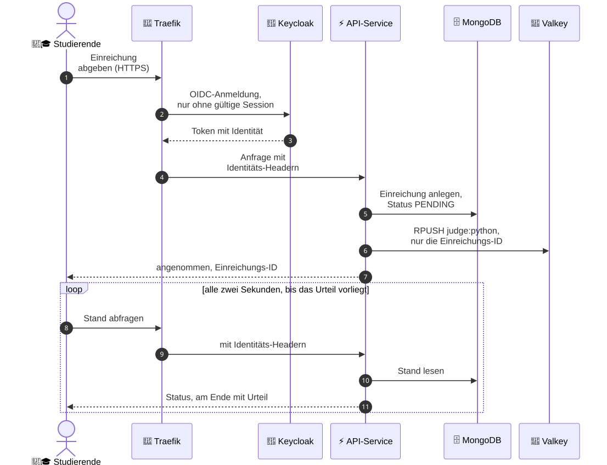
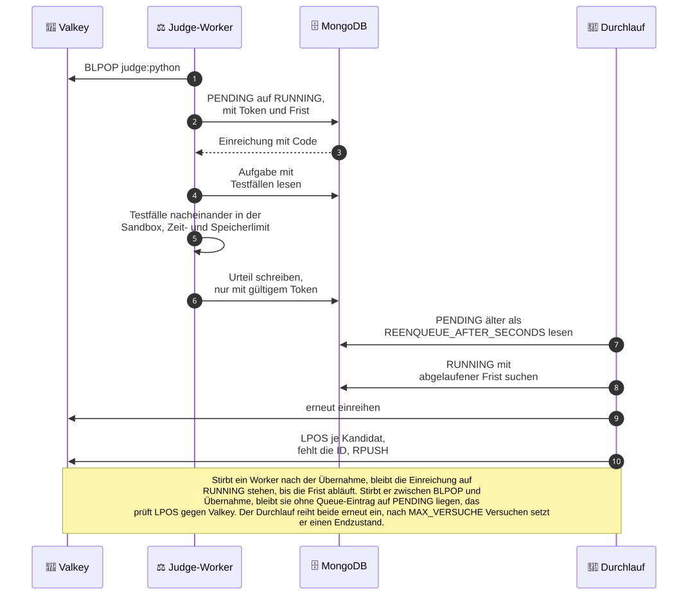

# Online-Judge-Cloud

## Problem

Programmieraufgaben von Hand zu korrigieren skaliert nicht. Bei mehreren
hundert Einreichungen je Aufgabe entscheidet die Korrekturkapazität darüber,
wie oft Studierende überhaupt abgeben dürfen. Der Online Judge führt
eingereichten Code automatisch gegen hinterlegte Testfälle aus und gibt das
Urteil zurück. Zwei Eigenschaften der Domäne prägen die Infrastruktur. Die
Last ist stoßweise, denn der Judge wird in Prüfungen eingesetzt, ein ganzer
Kurs arbeitet im selben Zeitfenster und zwischen den Terminen liegt der
Betrieb nahe null. Und der ausgeführte Code ist fremd. Endlosschleifen,
Speicherfresser und Zugriffe auf das Netz sind der Normalfall, nicht die
Ausnahme.

## Architektur

Terraform legt die VMs im Kursprojekt an, Ansible rollt darauf mit der
k3s-Rolle den Cluster aus. Die sechs VMs verteilen sich auf drei Rollen. Der
Server trägt die Steuerung und nimmt sonst nur Addons auf, drei Dienste-Nodes
tragen MongoDB, Valkey, PostgreSQL, Keycloak, die API und das Monitoring, zwei
Judge-Nodes führen eingereichten Code aus. Von außen führt ein einziger Weg
hinein. Die DNS-Zone zeigt auf die öffentliche IPv6 der Nodes, dort nimmt
Traefik jede Anfrage entgegen und lässt sie erst nach geprüfter Anmeldung zur
API durch.

### Aufbau

<!-- Quellen der Diagramme: docs/diagramme/*.mmd, von Hand gepflegt, ein
     Generator kann den Datenfluss nicht aus den Manifesten ableiten.
     Nach einer Änderung scripts/diagramme.sh laufen lassen und die SVGs
     mitcommitten. -->


Terraform und Ansible laufen von außen und sind zur Laufzeit nicht
beteiligt. Die Anwendung im Kasten der Dienste-VMs zeigt das zweite Bild
im Einzelnen, die dicken Pfeile sind der Weg einer Einreichung, die
gestrichelten sind Anmeldung, Skalierung, Rückholung und Monitoring.



### Datenfluss einer Einreichung

Die Annahme läuft über Gateway und API, die Studierenden fragen danach
alle zwei Sekunden nach dem Stand.



Die Bewertung läuft parallel dazu im Worker, der Durchlauf holt zurück, was
liegen bleibt.



Bei der Übergabe an den Worker entscheidet sich, ob eine Einreichung verloren
gehen kann. Der Worker übernimmt sie mit einem bedingten Update, das Token und
Frist setzt, und schreibt das Urteil nur mit gültigem Token. Stirbt ein
Worker-Pod nach der Übernahme, läuft die Frist ab und der Durchlauf reiht die
Einreichung erneut ein, bis MAX_VERSUCHE erreicht ist. Sie läuft dann
schlimmstenfalls mehrfach. Stirbt der Pod zwischen dem Lesen aus der Liste und
der Übernahme, bleibt die Einreichung auf PENDING liegen, ohne dass je eine
Frist zu laufen beginnt (#85). Auch das holt der Durchlauf zurück. Bleibt eine
PENDING-Einreichung länger als REENQUEUE_AFTER_SECONDS ohne neuen
Queue-Eintrag, reiht er sie erneut ein, bis MAX_VERSUCHE erreicht ist (#113).

## Betrieb

Terraform legt die VMs an, Ansible baut darauf den k3s-Cluster samt der
Datendienste (MongoDB, Valkey, PostgreSQL), dem Judge-Worker und dem Seed der
Aufgaben und rollt die eigene API als Helm-Release aus (`app/chart`). Die
Images baut `.github/workflows/images.yml` nach ghcr.io. Ein neues Package
entsteht dort mit der Sichtbarkeit privat und wird einmal von Hand auf
öffentlich gestellt, danach zieht der Cluster es ohne Zugangsdaten.

VPN an für Terraform, VPN aus für alles andere. Terraform spricht mit der
OpenStack-API und braucht den Tunnel. SSH, Ansible und kubectl erreichen die
Nodes über deren öffentliches IPv6 aus dem Internet, und der Full-Tunnel kappt
genau das. Voraussetzung ist IPv6 am eigenen Anschluss, sonst bleibt nur der
Campus.

Der Cluster ist seit dem 10.09.2026 einer für die ganze Gruppe (#299), die
Nodes heißen fest `judge-k3s-server`, `judge-k3s-dienste-<n>` und
`judge-k3s-judge-<n>`. Terraform-State, Application Credential und DNS-Zone
liegen bei der betreibenden Person, heute Johannes. Nur sie fährt Terraform
und damit `scripts/deploy.sh`, alle anderen fahren Ansible und kubectl gegen
den bestehenden Cluster. Ein Neuaufbau von Null aus ihrem State ersetzt den
Cluster und ist eine Downtime für alle, er wird vorher in #299 oder im
Gruppenchat angesagt.

### Einrichten

Auf dem eigenen Rechner liegen Python 3.12, Terraform, Docker, kubectl,
direnv, sops und age. `scripts/infra-check.sh` ruft `terraform` auf,
`scripts/diagramme.sh` und `scripts/chart-check.sh` rufen `docker` auf, mit
`kubectl` prüft man den Cluster nach dem Ausrollen. Helm liegt nicht lokal,
es läuft im Container. Seine Version steht einmal im Repo, als
`judge_helm_version` in `ansible/deploy.yaml`, und `scripts/chart-check.sh`
liest sie von dort. Die Terraform-Version steht in
`.github/workflows/infra.yml`, die Python-Version in beiden Workflows.

Einmal je Person:

```bash
python3 -m venv .venv && source .venv/bin/activate
pip install -r requirements.txt
brew install sops age
mkdir -p ~/.config/sops/age && age-keygen -o ~/.config/sops/age/keys.txt
direnv allow
```

Unter Windows läuft das in WSL mit Ubuntu 24.04, dort vor dem Block oben
statt `brew`:

```bash
sudo apt update && sudo apt install python3-venv direnv age curl
curl -fsSL -o /tmp/sops.deb https://github.com/getsops/sops/releases/download/v3.13.3/sops_3.13.3_amd64.deb && sudo apt install /tmp/sops.deb
```

Für sops gibt es in apt kein Paket, deshalb das Release von GitHub, geprüft
mit 3.13.3, auf einem ARM-Gerät die Datei mit `arm64` im Namen.

Die Geheimnisse liegen verschlüsselt im Repo (#77), in
`ansible/app-credentials.sops.yaml` die Passwörter der Dienste, der
Auth-Kette und der TSIG-Key der DNS-Zone, in `ansible/kubeconfig.sops.yaml`
die kubeconfig mit Admin-Rechten. Verschlüsselt ist mit sops und age, je
Person ein Schlüsselpaar. `age-keygen` gibt den öffentlichen Schlüssel aus
(`age1...`), der kommt per PR in `.sops.yaml`, danach fährt jemand mit
Schlüssel `sops updatekeys` über beide Dateien. Der private Schlüssel bleibt
in `~/.config/sops/age/keys.txt`, dorthin zeigt `SOPS_AGE_KEY_FILE` aus
`.envrc`. Ansible entschlüsselt beim Ausrollen selbst, die kubeconfig holt
man sich einmal:

```bash
sops -d ansible/kubeconfig.sops.yaml > ansible/kubeconfig-generated.yaml
chmod 600 ansible/kubeconfig-generated.yaml
```

Dorthin zeigt `KUBECONFIG` aus `.envrc`. Nach einem Neuaufbau des Clusters
committet die betreibende Person die neue `kubeconfig.sops.yaml`, dann noch
einmal `sops -d`. Zone und E-Mail stehen im Klartext in
`ansible/vars/dns.yaml`, die Vorlage `ansible/app-credentials.yaml.example`
erklärt jeden Wert und braucht nur, wer die Datei neu anlegt. Ohne direnv
stattdessen `source .envrc` im Wurzelverzeichnis, die Datei setzt KUBECONFIG
relativ zum aktuellen Verzeichnis.

Nur die betreibende Person dazu:

```bash
cp terraform/terraform.tfvars.example terraform/terraform.tfvars
```

Die Kopie ausfüllen, die Kommentare darin sagen, woher die Werte kommen.

SSH auf die Nodes läuft über die GitHub-Konten der Gruppe. Das eigene Konto
kommt per PR in `ansible/vars/ssh-konten.yaml`, das Play `SSH-Schlüssel der
Gruppe eintragen` holt bei jedem Lauf die Schlüssel aller Konten von
`https://github.com/<konto>.keys` und trägt genau diese Menge für `ubuntu`
auf allen Nodes ein, auf dem laufenden Cluster reicht `--tags ssh`. Wer aus
der Liste fällt oder seinen Schlüssel bei GitHub löscht, verliert den Zugang
beim nächsten Lauf. Das Konto der betreibenden Person muss den Schlüssel aus
`terraform.tfvars` führen, das Play bricht ab, wenn keiner der heutigen
Schlüssel in der neuen Menge liegt. Das Inventory
`ansible/inventory/generated-inventory.yml` liegt im Repo und trägt nur
Adressen und Rollen der Nodes. Wer Ansible fährt, braucht damit `git pull`
und den eigenen age-Schlüssel, sonst nichts von der betreibenden Person.

### Cluster hochbringen

Nur die betreibende Person:

```bash
scripts/deploy.sh
```

Das Skript prüft erst die tfvars, den age-Schlüssel und die Werkzeuge,
wartet mit VPN an auf die OpenStack-API und lässt `terraform init` und
`terraform apply` laufen. Dann hält es an der VPN-Grenze, fordert zum
Ausschalten auf und wartet, bis der Server über IPv6 auf Port 22 antwortet.
Danach laufen `ansible-galaxy` und `ansible-playbook` mit `deploy.yaml`
durch, am Ende zeigt `kubectl get nodes` den Stand.

Nicht jeder Lauf braucht den ganzen Stack. Die Schritte einzeln, jeweils aus
dem Wurzelverzeichnis. Terraform fährt nur die betreibende Person, alle
anderen beginnen beim Ansible-Block:

```bash
# VPN an
terraform -chdir=terraform init && terraform -chdir=terraform apply

# VPN aus
cd ansible
ansible-galaxy install -r requirements.yml --force
ansible-playbook -i inventory/generated-inventory.yml deploy.yaml
cd ..
kubectl get nodes
```

`terraform apply` schreibt dabei `ansible/inventory/generated-inventory.yml`.
Ändern sich Nodes, gehört die Datei in den nächsten Commit, sonst fahren die
anderen Ansible gegen alte Adressen. Terraform legt auch die Security Group
`judge-k3s-nodes` an und hängt sie statt der offenen default-Gruppe an alle
Nodes (#213). Zwischen den Nodes ist alles offen, von außen nur IPv6 auf 22,
80, 443 und 6443, die private IPv4 liegt hinter NAT. Wird das Ubuntu-Image
auf newstack neu hochgeladen, bekommt es eine neue ID, der Wert aus
`openstack image list` kommt in die tfvars.

Die Dienste- und die Judge-Nodes tragen ihre Rolle als Label ab der
Registrierung. Die Werte stehen in `terraform/outputs.tf` und gehen als
`k3s_node_labels` an die k3s-Rolle. Die Dienste-Nodes tragen
`online-judge/rolle=dienste`, daran binden MongoDB, Valkey, PostgreSQL,
Keycloak, die API und Longhorn ihren nodeSelector. Die Judge-Nodes tragen
`online-judge/sandbox=runsc` und denselben Wert noch einmal als Taint mit
NoSchedule. Auf einen Judge-Node kommt damit nur, was dieses Taint toleriert,
und das tun die RuntimeClass `gvisor` und der `agent-plan` des
system-upgrade-controller. Der Server trägt kein Rollen-Label, ihn grenzt
allein `CriticalAddonsOnly=true:NoSchedule` ab. Dieses Taint tolerieren die
Addons von k3s, darunter coredns, metrics-server und Traefik. Ein nodeSelector
bindet sie nicht an den Server, Traefik kann deshalb auch auf einem
Dienste-Node liegen.

### Anwendung

Das Chart `app/chart` rollt die eigenen Dienste aus, die API (`backend`) und
die Judge-Kette aus Worker, ScaledObject und Rückhol-CronJob. MongoDB, Valkey
und der Seed der Aufgaben gehören zur Infrastruktur und stehen schon im
Cluster. Das Chart verbindet sich mit ihnen über `externe` in den values, mit
MongoDB über das Operator-Secret, das die URI samt Zugangsdaten hält, und mit
Valkey über das Secret aus dem Play `valkey`, den Wert aus
`app-credentials.sops.yaml` (#61). Das Secret trägt die URI als
`connectionString` für Backend, Worker und Durchlauf und das rohe Passwort
für die TriggerAuthentication von KEDA. Das Play mit dem Tag `app` kopiert den
Chart auf den Server und ruft `helm upgrade --install`.

```bash
# nach dem Cluster-Deploy, VPN aus
(cd ansible && ansible-playbook -i inventory/generated-inventory.yml deploy.yaml --tags app)
```

Der ausgerollte Stand steht als `appVersion` in `app/chart/Chart.yaml`,
gebaut von `.github/workflows/images.yml` bei einem Git-Tag. `ansible/vars/app.yaml` liest den
Wert von dort und reicht ihn als Image-Tag an Helm und den Seed-Job durch.
`app_values_env` wählt zwischen den Overlays `values-prod.yaml` mit zwei
API-Replicas und `values-dev.yaml` mit einer API-Replica, kleineren Grenzen an der API und
höchstens zwei Workern, der Worker behält seinen Kern. `values.schema.json` bricht das Ausrollen ab, wenn der
Image-Tag, die Anbindung der Datendienste oder ein Eintrag unter `judge`
fehlt.

Eine weitere Sprache ist ein Eintrag unter `judge.sprachen` in den values,
samt eigenem Worker-Image. Das Chart erzeugt daraus Deployment und
ScaledObject. Die API führt ihre eigene Liste, `AKTIVE_SPRACHEN` in
`app/backend/main.py`. Fehlt die Sprache dort, lehnt `/submit` jede
Einreichung dafür mit 400 ab.

Prüfen mit `kubectl get pods -n judge`, dort steht `backend` auf Running.
`kubectl get cronjob,scaledobject -n judge` zeigt `durchlauf` und
`code-worker-python`. Das Worker-Deployment hat ohne wartende Einreichungen
null Replicas, KEDA startet es bei Last.

Die Ergebnisseite `/einreichung/{sub_id}` zeigt je Testfall Urteil, Laufzeit
und Speicher, bei überschrittener Zeit- oder Ausgabegrenze dazu die Meldung
des Judge. Mehr zeigt sie nur für Beispiele, also Testfälle mit `sample` in
der Aufgabe. Dort stehen der Name und bei falscher Ausgabe Eingabe, erwartete
und erhaltene Ausgabe. Jeder andere Testfall heißt "Testfall N", und bei
falscher Ausgabe, Laufzeitfehler oder Speicherfehler steht dort nur "Testfall
nicht einsehbar" (#208). `/submission/{sub_id}` gibt das Dokument roh als
JSON zurück, `eingabe`, `erwartet` und `erhalten` stehen darin nur bei
Beispielen.

### Aufgaben laden

Das Play mit dem Tag `seed` führt den Seed der Aufgaben als Job aus. Der Job
nutzt das Worker-Image, `laden.py` und die Aufgaben-JSONs kommen als
ConfigMap in den Cluster. Der Seed bleibt in Ansible, weil er Dateien aus dem
Repo braucht.

```bash
# nach dem Cluster-Deploy, VPN aus
(cd ansible && ansible-playbook -i inventory/generated-inventory.yml deploy.yaml --tags seed)
```

Prüfen mit `kubectl get jobs -n judge`, dort steht `aufgaben-seed` auf
Completed.

### Abnahme nach dem Deploy

```bash
scripts/smoke.sh
```

Das Skript wartet auf den Rollout der Chart-Workloads, lässt per SSH auf dem
Server `helm test online-judge` laufen und prüft danach den Pod-Verkehr über
Node-Grenzen, die Queue-Metrik in Prometheus und den Wert des ScaledObject.
Der Testjob `test-api` spricht die API am Service an, `test-loesungen` reicht
die Beispiellösungen aus `app/chart/loesungen` über `/submit` ein und
vergleicht die Urteile mit den Dateinamen. Jede fehlgeschlagene Prüfung nennt
das nächste Kommando. Die NetworkPolicies prüft `scripts/policycheck.sh`, je
Pod eine Verbindung, die gehen muss, und eine, die nicht gehen darf.
Zustandsprüfungen wie CrashLooping oder ungebundene PVCs kommen als
Alert-Regeln aus dem kube-prometheus-stack und werden nicht nachgebaut. Für
die Fehlersuche darüber hinaus taugen k9s und
`kubectl logs -l <selector> --prefix`, bei Bedarf stern, das sich auch an
später gestartete Pods hängt.

### Authentifizierung

Die Anmeldung passiert am Gateway, nicht in der Anwendung (#20). Eine
Anfrage an `app.<zone>` läuft durch Traefik, das den OIDC-Flow über das
Plugin [traefik-oidc-auth](https://github.com/sevensolutions/traefik-oidc-auth)
selbst ausführt, ohne zweiten Dienst. Ohne gültige Session leitet das Plugin
zur Keycloak-Anmeldung um, nach der Anmeldung füllt es die Identität aus den
Token-Claims in `X-Auth-Request-*`-Header, die es an die API weiterreicht.
Die API prüft keine Tokens, sie liest nur diese Header (`app/backend/auth.py`)
und weist eine Anfrage ohne sie mit 401 ab. Dazu vergleicht sie den festen
Herkunftswert `X-Gateway-Auth`, den nur das Gateway setzt, siehe W6. Die
Anwendung bleibt so frei von Login-Seite und Token-Austausch.

Keycloak läuft mit zwei Replicas gegen eine PostgreSQL, die CloudNativePG als
Cluster `keycloak-db` mit zwei Instanzen im selben Namespace führt (#163).
Realm, OIDC-Client, die Rolle `dozent`, ein Test-Benutzer und ein
Dozentenkonto mit dieser Rolle kommen als Code aus der Vorlage
`ansible/templates/keycloak-realm.json.j2`, die Namen und Passwörter der
Konten aus `app-credentials.sops.yaml`. Der gerenderte Import liegt als
Secret im Namespace, denn er trägt das Client-Secret und die Passwörter.
Den Import fährt ein Job mit `kc.sh import --override true` gegen die
Datenbank, nur wenn sich die Vorlage seit dem letzten Import geändert hat,
und bei angehaltenem StatefulSet, denn die Keycloak-Doku verlangt für den
Import mit Override, dass kein Keycloak läuft. Nach so einer Änderung ist
die Vorlage der Stand des Realms, was in der Admin-Konsole geändert oder
angelegt wurde, ist dann weg. Mit dem Realm gehen auch seine
Signaturschlüssel, das Plugin lädt neue Schlüssel höchstens alle fünf
Minuten nach, in den ersten Minuten nach einer Änderung an der Vorlage kann
eine Anmeldung deshalb scheitern.

Die Anmeldeseite zeigt das DHBW-Layout aus `docs/oberflaeche/login.html`
(#122). Das Theme `dhbw` ist eine ConfigMap, die das Play als Ordner
`/opt/keycloak/themes/dhbw` in den Pod hängt, `dhbw.css` und `logo.jpg`
kommen aus `app/backend/static`, damit Anwendung und Anmeldung dieselbe Datei
tragen. Eine geänderte ConfigMap liest Keycloak erst nach einem Neustart des
Pods.

Das Plugin wird in der statischen Traefik-Konfiguration aktiviert
(`ansible/tasks/traefik-plugin.yaml`, per `HelmChartConfig`), wobei Traefik einmal
neu startet. Die Datenbank rollt das Play `postgres` aus, Keycloak und die
Traefik-Anbindung das Play `auth`. Beim ersten Mal beide zusammen, `auth`
allein setzt die Datenbank voraus und bricht ohne sie mit einem Hinweis ab:

```bash
# nach dem Cluster-Deploy, VPN aus
(cd ansible && ansible-playbook -i inventory/generated-inventory.yml deploy.yaml --tags postgres,auth)
```

Prüfen. `https://auth.<zone>` zeigt den Realm `judge`, ein Aufruf von
`https://app.<zone>` leitet unangemeldet zur Anmeldung um, und nach der
Anmeldung mit dem Test-Benutzer aus `app-credentials.sops.yaml` ist die API
erreichbar. Das Dozentenkonto aus derselben Datei trägt die Realm-Rolle
`dozent` und sieht zusätzlich `/verwaltung`. Ein direkter Aufruf des
`backend`-Service im Cluster ohne Gateway-Header endet mit 401.

### Cluster-Zugriff per OIDC

Dieselbe Keycloak-Kennung öffnet einen lesenden `kubectl`-Zugriff auf den
Cluster, RBAC im Cluster statt in der Anwendung. Drei Teile greifen dafür
ineinander, alle rollt der Tag `auth` aus. Ein zweiter, öffentlicher Client
`kubernetes` im Realm mit der Gruppe `cluster-viewer`, einem Mapper für den
`groups`-Claim und dem Konto `viewer` in dieser Gruppe. Die OIDC-Flags am
`kube-apiserver` über ein Config-Drop-in (`ansible/tasks/k3s-oidc.yaml`), mit
dem Präfix `oidc:` an Name und Gruppe. Und ein `ClusterRoleBinding`
(`ansible/files/viewer-clusterrolebinding.yaml`), das `oidc:cluster-viewer` an die
eingebaute ClusterRole `view` hängt, lesen ja, schreiben nein, Secrets nein.

Auf dem eigenen Rechner braucht es das Plugin
[kubelogin](https://github.com/int128/kubelogin) und einen
kubeconfig-Eintrag, der auf Keycloak zeigt. krew ist der Plugin-Manager
von kubectl, unter macOS `brew install krew`, unter Linux nach
[krew.sigs.k8s.io](https://krew.sigs.k8s.io/docs/user-guide/setup/install/),
danach gehört `~/.krew/bin` in den PATH:

```bash
export PATH="${KREW_ROOT:-$HOME/.krew}/bin:$PATH"
kubectl krew install oidc-login
kubectl oidc-login setup --oidc-issuer-url=https://auth.<zone>/realms/judge --oidc-client-id=kubernetes
kubectl config set-credentials viewer \
  --exec-api-version=client.authentication.k8s.io/v1beta1 \
  --exec-command=kubectl \
  --exec-arg=oidc-login \
  --exec-arg=get-token \
  --exec-arg=--oidc-issuer-url=https://auth.<zone>/realms/judge \
  --exec-arg=--oidc-client-id=kubernetes
kubectl config set-context judge-viewer --cluster=default --user=viewer
kubectl config use-context judge-viewer
```

`setup` öffnet den Browser-Login mit dem Konto `viewer` aus
`app-credentials.sops.yaml` und zeigt die Claims des Tokens, dort muss
`groups` mit `cluster-viewer` stehen, sonst greift das Binding nicht.
Danach hält kubelogin das Token bis zum Ablauf. Prüfen mit `kubectl auth whoami`, dort steht `oidc:viewer`,
`kubectl get pods -A` geht, `kubectl get secrets -n judge` und
`kubectl delete pod -n judge <pod>` enden mit Forbidden. Zurück geht es mit
`kubectl config use-context default`, die Admin-kubeconfig bleibt gültig.

### Dashboard

Prometheus und Grafana laufen im Namespace `monitoring`, ausgerollt mit
`--tags observability,keda`. Beide Tags zusammen, weil der ServiceMonitor den
Metrikport des KEDA-Operators braucht und den erst das KEDA-Play öffnet. Das
Dashboard `Judge unter Last` liegt als Code in
`ansible/files/dashboard-judge.json` und zeigt die Zahl der Worker-Replicas
und die Länge von `judge:python`. Beide Kurven zusammen machen sichtbar, dass
KEDA auf die Warteschlange reagiert.

`https://grafana.<zone>` zeigt nach der Anmeldung direkt das Dashboard, es
ist als Startseite gesetzt. Der Benutzer heißt `admin`, das Passwort setzt
`grafana_admin_password` aus `app-credentials.sops.yaml`. Anders als die
Anwendung hängt Grafana nicht hinter der Anmeldung aus #20, es prüft selbst.

Ohne Last stehen beide Kurven auf null. Einreichungen erzeugt der
Lastgenerator `app/chart/lastgenerator.py`. Er läuft als Pod im Namespace
`judge`, weil die backend-NetworkPolicy aus #62 Ingress nur von benannten
Pods zulässt. Das Chart legt ihn als angehaltenen CronJob an, einen Lauf
startet ein Job aus dieser Vorlage.

```bash
# VPN aus
kubectl create job -n judge --from=cronjob/lastgenerator lastgenerator-1
kubectl logs -n judge -f job/lastgenerator-1
```

Rate und Dauer stehen in `app/chart/values.yaml` unter `lastgenerator`, 6 je
Sekunde über 60 Sekunden, also 360 Einreichungen. Gemessen am 11.09.2026
stieg die Warteschlange damit auf 207, KEDA startete die ersten Worker nach
32 Sekunden und hatte nach 58 Sekunden alle sechs bereit, nach 147 Sekunden
war die Schlange leer. Mit 2 je Sekunde bleibt die Schlange unter 12 und
drei Worker reichen. Der Job bleibt mit seinem Log stehen, bis `kubectl delete job` ihn
entfernt, ein zweiter Lauf braucht einen neuen Namen.

### Vor dem Push

```bash
./scripts/check.sh
```

Das Skript ruft die Prüfungen nacheinander auf und läuft auch nach einem
Fehlschlag weiter. Die Einzelaufrufe bleiben gültig:

```bash
./scripts/infra-check.sh   # terraform fmt und validate, ansible-lint, sops
./scripts/chart-check.sh   # helm lint und Schema, im Container
ruff check . && ruff format --check .
./scripts/unit-tests.sh    # pytest in den Dienst-Images
./scripts/diagramme.sh     # nur nach Änderung an docs/diagramme/*.mmd
```

Dieselben Prüfungen laufen in `.github/workflows/lint.yml` und
`.github/workflows/infra.yml`. Der Diagramm-Job vergleicht die
gerenderten SVGs mit dem Commit, eine geänderte `.mmd` ohne mitcommittete
SVG macht den Pull Request rot.

## Entscheidungen

| Thema | Wahl | Alternative | Trade-off | Aus der Domäne |
|---|---|---|---|---|
| P1 Anwendung | Zustand in MongoDB, Queue trägt nur die ID, Code läuft als Subprozess im Worker | Stream mit vollem Job, Container je Testlauf | zweiter Zugriff auf MongoDB je Einreichung | keine Einreichung geht verloren, auch nicht mit der Queue |
| P2 Infrastruktur | Terraform, Ansible mit der k3s-Rolle der Vorlesung, ein gemeinsamer Cluster, Geheimnisse mit sops im Repo | eigene Rolle, eigenes Netz mit Floating IP, ein Cluster je Person | Abhängigkeit vom Upstream, Neuaufbau ist Downtime für alle | Prüfungsbetrieb ist zeitweise, ein Cluster aus einem Ablauf ist billiger als Dauerpflege |
| P3 Deployment | Request gleich Limit am Worker, Werte aus Messungen, Tags aus Version und Commit | Request an der Last, Spitzen am Limit, VPA | gebundene Kerne | das Zeitlimit gilt als Frist, ein gedrosselter Worker reißt sie |
| P4 Platzierung | Judge-Nodes mit Taint, RuntimeClass bindet die Worker dorthin | podAntiAffinity auf gemeinsamen Nodes | zwei VMs mehr | fremder Code läuft auf Nodes ohne die Pods von MongoDB, Keycloak und API |
| P5 Resilienz | Replica-Set mit drei Members, Keycloak mit zwei Replicas auf PostgreSQL, Probes an jedem Dienst | ein Member, H2 auf einem PVC | drei Dienste-Nodes, ein weiterer Operator | Einreichungen sind Prüfungsleistungen, die Anmeldung darf zu Klausurbeginn nicht fehlen |
| W1 Packaging | eigenes Chart mit values-dev, values-prod und Schema | Kustomize, Manifeste je Umgebung über Ansible | Vorlagensprache zwischen Manifest und Cluster | eine zweite Sprache ist ein Eintrag in den values |
| W6 Authentifizierung | OIDC am Gateway über das Traefik-Plugin, RBAC über dieselbe Kennung | oauth2-proxy mit ForwardAuth, Token-Prüfung in der API, Admin-kubeconfig je Person | fester Herkunftswert zwischen Gateway und API | ein aus der Sandbox ausgebrochener Worker hält kein Token |
| W7 Cluster-Härtung | default-deny in beide Richtungen, sops mit age | Freigabe nach Absenderadresse, Sealed Secrets, Passwörter beim Ausrollen erzeugt | jede neue Komponente braucht eine Policy | der Worker führt fremden Code aus, der Radius eines Ausbruchs ist die Policy |

### P1 Anwendung und Domäne

Der Zustand einer Einreichung liegt in MongoDB, die Valkey-Liste
`judge:<sprache>` trägt nur ihre ID, und der Worker führt den Code als
Subprozess unter eigener UID aus, mit Grenzen für Rechenzeit, Speicher,
Ausgabe und Prozesszahl. Die Alternative war ein Stream mit dem vollen Job
und dem Ergebnis über die Queue zurück, und für die Ausführung ein Container
je Testlauf. Der Stream hätte den Zustand an zwei Stellen geführt, der
Container je Lauf kostete gemessen 1,2 Sekunden Start je Testfall gegenüber
20 Millisekunden für den Subprozess (#6). Der Preis ist ein zweiter Zugriff
auf MongoDB je Einreichung, dafür überlebt eine Einreichung den Verlust der
Queue, und der Durchlauf holt sie über Frist und Zähler zurück. In einer
Klausur darf keine Einreichung verloren gehen, das entscheidet.

### P2 Infrastruktur als Code

Terraform legt gegen den OpenStack-Provider sechs VMs, das Keypair und die
Security Group `judge-k3s-nodes` an (#213), Ansible rollt mit der
k3s-dhbw-cloud-role aus der Vorlesung, auf einen Commit gepinnt, den Cluster
samt Longhorn, cert-manager, ExternalDNS und system-upgrade-controller aus.
Die Nodes hängen direkt am DHBWV6-Netz. Seit #299 gibt es einen Cluster für
die Gruppe, die Geheimnisse liegen mit sops im Repo, SSH-Schlüssel kommen aus
den GitHub-Konten. Die Alternativen waren eine eigene Ansible-Rolle, ein
eigenes Netz mit Floating IP (gebaut und am selben Tag zurückgenommen) und
ein Cluster je Person. Der Preis ist die Abhängigkeit vom Upstream der Rolle
und ihren Vorgaben, etwa Longhorn mit einem Replikat je Volume und dem
Upgrade-Fenster, und jeder Neuaufbau ist eine Downtime für alle. Der Judge
läuft nur an Prüfungstagen, ein Cluster, der in einem Ablauf neu entsteht,
ist billiger als einer, der dauerhaft gepflegt wird. Fremder Code im Stack
ist die k3s-Rolle mit ihren Addons, der MongoDB Community Operator,
CloudNativePG, das keycloakx-Chart, der kube-prometheus-stack, KEDA, das
Plugin traefik-oidc-auth, sops mit age und kubelogin.

### P3 Deployment und Konfiguration

Jeder Container trägt Requests und Limits aus einer Messung, der Worker mit
Request gleich Limit bei der CPU. Die Images tragen Tags aus Version und
Commit, `latest` gibt es nicht, die Konfiguration kommt über ConfigMaps und
Secrets in die Pods. Die Alternative war ein CPU-Request an der Last, dessen
Spitzen das Limit auffängt, oder ein VPA, der die Werte nachführt. Der Preis
sind gebundene Kerne, sechs Worker halten sechs Kerne, auch wenn eine
Einreichung wartet statt zu rechnen. Den Ausschlag gibt das Urteil. Das
Zeitlimit einer Aufgabe gilt als Frist auf die vergangene Zeit, ein Worker,
der seinen Kern nicht bekommt, reißt sie, ohne die Rechenzeit zu erreichen,
und eine korrekte Einreichung bekäme TLE. Die Herleitung jeder Zahl steht
unter Herleitungen zu P3.

### P4 Scheduling und Platzierung

Die zwei Judge-Nodes tragen das Label `online-judge/sandbox=runsc` und
denselben Wert als Taint, die RuntimeClass `gvisor` toleriert ihn und bindet
jeden Worker-Pod über ihren nodeSelector dorthin. Die drei Dienste-Nodes
tragen `online-judge/rolle=dienste`, daran hängen MongoDB, Valkey,
PostgreSQL, Keycloak, die API und Longhorn. Die Alternative ohne zusätzliche
Nodes war eine podAntiAffinity am Worker gegen MongoDB und Keycloak. Mit
`required` bliebe der Worker Pending, sobald alle Nodes ein Member tragen,
mit `preferred` liefen Judge und Dienste weiter auf denselben Nodes. Der
Zuschnitt kostet zwei Instanzen mehr. Drei Dienste-Nodes, weil das
Replica-Set den Verlust eines Nodes nur mit drei Members auf drei Nodes
übersteht, zwei Judge-Nodes für den Durchsatz. Fremder Code läuft so auf
Nodes, auf denen außer den k3s-Addons und dem Upgrade-Job nichts läuft, ein
Ausbruch aus der Sandbox erreicht weder die Pods noch die Secrets von
MongoDB, Keycloak und API auf dem Node. Was der Worker-Pod selbst hält,
bleibt erreichbar, siehe Grenzen.

### P5 Resilienz und Persistenz

MongoDB läuft als Replica-Set mit drei Members über den Community Operator,
je Member ein Longhorn-PVC. Keycloak läuft mit zwei Replicas gegen eine
PostgreSQL aus CloudNativePG mit zwei Instanzen (#163), Valkey mit einem
PVC. Jeder dauerhaft laufende Dienst trägt Probes, die API rollt mit
`maxUnavailable` 1. Die
Alternativen waren ein einzelnes Member und für Keycloak die eingebettete
H2-Datei auf einem PVC, der Stand bis zum 10.09., bei dem die Anmeldung je
Pod-Wechsel 55 Sekunden fehlte. Der Preis sind drei Dienste-Nodes und 800m
CPU für MongoDB, ein weiterer Operator, zwei Postgres-Pods und ein zweiter
Keycloak-Pod mit zusammen 1344Mi Request. Longhorn läuft mit einem Replikat
je Volume, der Verlust eines Dienste-Nodes nimmt die Volumes darauf mit,
Replica-Set und Postgres-Paar gleichen das aus, Valkey nicht. Einreichungen
sind Prüfungsleistungen, ihr Verlust ist nicht hinnehmbar, und die Anmeldung
darf zu Klausurbeginn nicht fehlen. Gemessen am 10.09. unter zehn
Anmeldungen je Sekunde, Rolling Update und Pod-Verlust ohne eine
fehlgeschlagene Anmeldung.

### W1 Packaging

Die Anwendung kommt aus einem eigenen Chart in `app/chart` mit
`values-dev.yaml`, `values-prod.yaml` und `values.schema.json`, die
Judge-Kette aus Worker, ScaledObject und Rückhol-CronJob eingeschlossen. Die
Alternativen waren Kustomize mit Base und zwei Overlays, oder die Manifeste
je Umgebung über Ansible einzuspielen, der Stand bis zum 19.08. Der Preis ist
eine Vorlagensprache zwischen Manifest und Cluster, wer wissen will, was im
Cluster steht, braucht `helm template` statt `cat`, und Objekte, die Helm
nicht gehören, muss man vor dem ersten Upgrade entfernen. Eine zweite Sprache
ist ein Eintrag unter `judge.sprachen` statt einer weiteren Datei, und dev
wird über weniger Worker klein statt über kleinere Grenzen, weil das
Zeitlimit als Frist gilt und ein gedrosselter Worker sie reißt.

### W6 Authentifizierung

Die Anmeldung läuft am Gateway, Traefik führt den OIDC-Flow über das Plugin
traefik-oidc-auth gegen Keycloak aus und reicht die Identität als Header an
die API, die API prüft kein Token, nur einen festen Herkunftswert
`X-Gateway-Auth`. Dieselbe Kennung trägt den lesenden Cluster-Zugriff, der
apiserver liest Name und Gruppe aus dem OIDC-Token, ein ClusterRoleBinding
hängt `oidc:cluster-viewer` an die ClusterRole `view`. Die Alternativen waren
oauth2-proxy mit ForwardAuth als zweiter Dienst, die Token-Prüfung gegen die
JWKS in der API und je Person eine Admin-kubeconfig oder ein ServiceAccount.
Der Preis ist der feste Herkunftswert, er läuft nie ab und steht im Secret
wie im Middleware-Objekt, und die OIDC-Flags am apiserver brauchen auf einem
laufenden Cluster einen Neustart von k3s. Den Ausschlag gibt der Worker, der
fremden Code ausführt. Wer aus der Sandbox ausbricht, hält weder ein Token
noch den Herkunftswert, und `automountServiceAccountToken` steht am Worker
auf false, im Cluster findet er auch kein Token.

### W7 Cluster-Härtung

Im Namespace `judge` gilt ein default-deny in beide Richtungen, daneben je
Pod-Art eine Policy mit Absendern und Zielen als Pod-Label
(`ansible/files/judge-networkpolicy.yaml`). Die Passwörter der Dienste, der
TSIG-Key und die kubeconfig liegen mit sops und age verschlüsselt im Repo,
Ansible entschlüsselt beim Ausrollen (#77). Die Alternativen waren
Freigaben nach Absenderadresse, deren Bestand nach einem Neuaufbau ungeprüft
ist, Sealed Secrets, deren Schlüssel je Cluster entsteht und beim Neuaufbau
von Null die versiegelten Werte wertlos macht, und beim Ausrollen erzeugte
Passwörter, die den Stand nur im Cluster hielten. Der Preis, jede neue
Komponente in `judge` braucht eine eigene Policy mit mindestens einer Regel
auf kube-dns, und ein ausscheidendes Mitglied kann alte Stände weiter lesen,
bis die Passwörter getauscht sind. Der Worker führt fremden Code aus, die
Policy begrenzt den Radius eines Ausbruchs auf MongoDB und Valkey.

### Herleitungen zu P3

**Judge-Worker.** Ein Kern als Request und Limit, 64Mi Speicher als Request,
320Mi als Limit. Gemessen sind unter Last 897m bis 1009m CPU und 44 bis 48 MiB
je Worker, das Speicherlimit deckt zusätzlich die 256 MB, die eine Aufgabe
für den Kindprozess fordern darf. Die Aufgaben im Repo setzen 2 bis 4
Sekunden Zeitlimit, eine ohne eigenes Limit fällt auf die 5 Sekunden aus dem
Worker zurück.

**Zuschnitt und keda.max.** Auf einem Judge-Node sind 4 Kerne verfügbar und
ohne Einreichungen 0 angefordert, weil dort weder Longhorn noch Traefik,
cert-manager, ExternalDNS oder KEDA laufen. Acht Worker passen rechnerisch,
dann sind beide Nodes voll und kubelet, containerd und runsc laufen ohne
eigenen Request. `keda.max` steht auf 6, bei drei zu drei bleibt ein Kern je
Node frei. Zugesagt ist das nicht, die Verteilungsregel ist eine Präferenz.

**Deckel für /work.** Das Arbeitsverzeichnis der Läufe liegt unter `/work`,
ein emptyDir mit `sizeLimit` 64Mi. Die Alternative war ein
`ephemeral-storage`-Limit am Container, das auch Container-Layer und Logs
erfasst und sich aus dem Bedarf eines Laufs nicht herleiten lässt. Ein Lauf
braucht höchstens rund 7 MiB, die Lösung mit höchstens 1 MiB Zeichen aus
`/submit`, also bis zu 4 MiB, die größte Eingabe im Repo mit 372 KB und
zwei Ausgabedateien à 1 MiB. 64Mi lassen davon das Neunfache. Der Deckel wirkt verzögert, kubelet
erhebt die Belegung etwa im Minutenabstand und räumt dann den ganzen Pod ab.
Die laufende Einreichung bleibt auf RUNNING, nach Ablauf ihrer Frist reiht
der Durchlauf sie beim nächsten Lauf alle zwei Minuten erneut ein, höchstens
dreimal. Das `/tmp` der Einreichung ist ein eigenes tmpfs je Lauf mit
16 MiB, das `/tmp` des Pods trägt denselben Deckel von 64Mi. Ein
Init-Container setzt `/tmp` auf 1777 und `/work` auf 0755.

**API.** 100m CPU und 64Mi Speicher als Request, 500m und 256Mi als Limit.
Im Leerlauf braucht die API 3m, unter Last 8m bis 9m, beim Start rund 55m
für etwa 15 Sekunden, weil sie ihre Indizes in MongoDB anlegt. Ein Request
unterhalb dieses Werts drosselt genau die Startphase und verlängert das
Rolling Update. Der Speicher steht bei 46 MiB in jedem Zustand.

**MongoDB.** Ein `mongod` bekommt 150m und 512Mi als Request, 500m und 1Gi
als Limit, der Sidecar `mongodb-agent` 100m und 128Mi, die Init-Container
und der Operator je 50m und 64Mi. Die Vorgaben des Operators setzen für
jeden Sidecar und Init-Container 500m an, die drei Pods forderten damit
2300m. Gemessen unter 15 Einreichungen je Sekunde bleibt der Sidecar bei
17m, der Operator bei 1m, nur `mongod` folgt der Last, sein Primary kommt
auf 129m. Die Init-Container stehen mit im Repo, weil Kubernetes den Request
eines Pods als Maximum aus laufenden Containern und größtem Init-Container
bildet.

**Keycloak.** 250m und 832Mi als Request, 1000m und 1152Mi als Limit, die
Heap-Decke über `JAVA_OPTS_KC_HEAP` fest auf 512Mi. Gemessen mit
`app/anmeldelast.py`, fünf Läufe mit 13970 Anmeldungen und bis zu 18 je
Sekunde, steigt der Pod von 560Mi auf 735Mi und bleibt dort, mit fester
Heap-Decke bei 707Mi. Ein Request am Leerlauf läge nach der ersten
Anmeldewelle unter dem Verbrauch. Eine Anmeldung kostet 59
Kern-Millisekunden, die 250m tragen rechnerisch vier Anmeldungen je Sekunde
je Replica. Mit zwei Replicas lagen beide Pods bei 22 Anmeldungen je Sekunde
bei 667Mi und 644Mi.

**PostgreSQL.** Je Instanz 100m und 256Mi als Request, 1000m und 512Mi als
Limit, der Operator 50m und 64Mi. Gemessen lag eine Instanz bei höchstens
119Mi mit den 40 Verbindungen beider Keycloak-Pods und im Betrieb unter 50m,
bei der Beförderung zum Primary bei 450m. Das Speicher-Limit folgt der
Rechnung aus `shared_buffers` 64MB und 100 Verbindungen zu je 4MB
`work_mem`, eine Obergrenze ist das nicht, der Beleg ist der Messwert unter
einem Viertel des Limits.

**Monitoring.** Prometheus, Grafana und kube-state-metrics tragen Werte aus
einer Messung am 30.08., die Herleitung steht als Kommentar in
`ansible/tasks/observability.yaml`.

### Herleitungen zu P5

**Startfenster der API.** Die startupProbe gibt dem Start 60 Sekunden,
`periodSeconds` 5 und `failureThreshold` 12. Gemessen am 23.08. unter
`docker run` mit CPU-Grenze, Zeit bis zur ersten 200 auf `/healthz`, bei
0,5 CPU rund 1 Sekunde, bei 0,05 rund 26. Die 0,05 sind der Request aus
`values-dev.yaml`, der Anteil, den ein voller Knoten dem Pod noch
garantiert. 60 Sekunden sind gut das Doppelte, als Reserve für langsamere
Kerne im Cluster. Ohne startupProbe müsste die liveness mit rund 35 Sekunden
den Start allein abdecken.

**Probes an Keycloak.** Keycloak übernimmt die drei Probes des
keycloakx-Charts, startup auf `/health` mit 315 Sekunden Fenster, liveness
auf `/health/live` mit 5 Sekunden Frist, readiness auf `/health/ready` mit 1
Sekunde, alle am Management-Port 9000. Ohne readiness schickte Traefik den
OIDC-Flow an einen Pod, der noch nicht antwortet. Der Start braucht
höchstens 35 Sekunden bis zum ersten 200, unter 22 Anmeldungen je Sekunde
lieferten 1170 Abfragen der beiden Endpunkte durchgehend 200 in höchstens
168 Millisekunden.

**Liveness-Probe am Judge-Worker.** Auf den Worker zeigt kein Service, eine
Probe fängt genau einen Fall, einen Worker, der lebt und nicht mehr
arbeitet. Der Worker schreibt nach jedem abgeschlossenen Schritt einen
Heartbeat, die mtime von `/run/heartbeat`. Die längste Lücke zwischen zwei
Schritten ist ein Sandbox-Lauf, er endet nach `zeit + 1 + ZEITFRIST_PUFFER`
und damit nach 61,5 Sekunden, dazu bis zu 5 Sekunden, bis der Worker den
per SIGKILL beendeten Prozess eingesammelt hat, und 1,0 Sekunde für das
Aufräumen, zusammen 67,5 berechenbare Sekunden. Die Frist von 120 Sekunden
lässt darüber hinaus Platz für das `rmtree`. Trifft die
Probe einen Worker, der noch arbeitet, holt der Durchlauf die Einreichung
zurück, ein Versuch ist verbraucht.

**Geordneter Auslauf der Judge-Worker.** Der Worker fängt SIGTERM ab,
übernimmt nichts Neues mehr, legt einen gezogenen Queue-Eintrag zurück und
rechnet die laufende Bewertung zu Ende, `terminationGracePeriodSeconds` 300,
hergeleitet in `app/chart/values.yaml`. Die Alternative war, den Verlust
unter Grenzen zu dokumentieren. Ein abgeschossener Lauf kostet einen der
drei Versuche, in einer Klausur entschiede der Zeitpunkt des Rollouts mit
über das Urteil. Der Preis ist ein Rollout von bis zu 300 Sekunden je Pod.
Gemessen im Cluster, Rollout bei laufender Bewertung, Urteil SUCCESS mit
einem Versuch, Pod nach acht Sekunden beendet.

**PostgreSQL für Keycloak.** Zwei Instanzen mit `switchoverDelay` 15, der
Wechsel des Primary dauerte gemessen 19 Sekunden und kostete 2 von 1644
Anmeldungen, mit der Vorgabe von 180 Sekunden wartete der Operator die volle
Frist, weil Keycloak seine Pool-Verbindungen nie schließt.

### Weitere Entscheidungen

**Realm-Import vor dem Serverstart.** `start --import-realm` überspringt
einen vorhandenen Realm, nur `kc.sh import` kennt `--override`. Er läuft als
Job gegen die Datenbank bei angehaltenem StatefulSet (#146, #163). Die
Alternative war die Admin-API aus Ansible, sie ließe von Hand angelegte
Benutzer stehen, bräuchte aber Token-Handling im Play und deckt `loginTheme`
und Sprache nicht. Der Import wechselt die Signaturschlüssel des Realms und
läuft deshalb nur bei geänderter Vorlage, ein Merker mit Prüfsumme liegt in
einer ConfigMap.

**Herkunftsprüfung an der API.** Das Gateway setzt `X-Gateway-Auth` mit
einem festen Wert, den die API vergleicht, wer den `backend`-Service direkt
erreicht, kommt so nicht unter fremdem Namen hinein. Die Alternative war das
Access-Token in der API gegen die JWKS zu prüfen, W6 verlangt die Prüfung
am Gateway. Wer Secret oder Middleware-Objekt lesen darf, kommt an der
Prüfung vorbei.

**Unit-Tests in den Dienst-Images.** `tests/` läuft mit pytest über
`scripts/unit-tests.sh` in den Images statt lokal, weil `worker.py` beim
Import die Sandbox initialisiert und so gegen dieselbe Python-Version und
glibc wie im Cluster geprüft wird. Der Preis, der CI-Job baut je Lauf beide
Images.

**Lastgenerator als Pod im Cluster.** Der Lastgenerator läuft als Pod in
`judge`, die backend-Policy nennt ihn über das Label `app: lastgenerator`.
Die Alternative war ein Lauf vom Server-Node mit Freigabe seiner Adresse,
die jeder Prozess dort teilt. Der Preis, andere Werte für Rate und Dauer
brauchen ein Upgrade des Release.

## Grenzen

Unter echter Last tragen sechs Worker den Judge. Gemessen am 11.09.2026 mit
dem Lastmix des Generators bauen sie eine Warteschlange von 207 in 60
Sekunden ab, 200 bis 250 Einreichungen je Minute, die meisten Lösungen
sind in unter einer Sekunde bewertet, das Zeitlimit von bis zu 16 Sekunden
je Bewertung ist die Obergrenze. Bis dahin wartet eine Einreichung in der
Schlange, dazu kommt der Anlauf der Worker, gemessen 32 Sekunden bis zur
ersten und 58 bis zur sechsten Replica, KEDA fragt die Schlange alle 30
Sekunden ab und weckt erst über `activationListLength`. Ein Kurs von 30
Personen mit je drei Abgaben in derselben Minute erzeugt 1,5 Einreichungen
je Sekunde, dafür reichen drei Worker, bei Rate 2 blieb die Schlange unter
12. Rechnerisch tragen die zwei Judge-Nodes
acht Worker, `keda.max` steht auf sechs, damit je Node ein Kern für kubelet,
containerd und runsc frei bleibt. Mehr Durchsatz heißt entweder `keda.max`
auf acht ohne diese Reserve oder mehr Judge-Nodes über `judge_count` in
`terraform/variables.tf`, und ein Neuaufbau ist seit #299 eine Downtime für
die Gruppe. Keycloak mit zwei Replicas trug am 10.09. 22 Anmeldungen je
Sekunde ohne Fehler, ein Failover der PostgreSQL kostete 2 von 1644
Anmeldungen in 19 Sekunden. Longhorn läuft mit einem Replikat je Volume, für
Valkey ohne Ausgleich.

Der eingereichte Code läuft als Subprozess im Judge-Worker, unter einer je
Lauf eigenen UID und mit eigenen Grenzen für Rechenzeit, Speicher,
Ausgabemenge und Prozesszahl. Diese Lücken bleiben.

Im Cluster bekommt der eingereichte Code über einen User-Namespace ein
eigenes, leeres Netz. Das setzt voraus, dass die Laufzeit `unshare` mit
`CLONE_NEWUSER` zulässt, containerd tut das, ein gesetztes seccomp-Profil
blockiert ihn. `SANDBOX_NETZ_ERZWINGEN=1` am Worker lässt ihn gar nicht erst
starten, wenn die Trennung nicht zustande kommt. Wo sie ausfiele, bliebe nur
die NetworkPolicy als Begrenzung.

`RLIMIT_NPROC` steht auf 0, eine Einreichung startet weder einen zweiten
Prozess noch einen zweiten Thread, sie bekommt RE mit einer eigenen Meldung.
Mit 1 statt 0 bekäme sie unter runsc einen zweiten Prozess, und zweimal die
erlaubten 256 MiB liegen über den 320Mi des Containers, der OOM-Kill träfe
dann den Pod. Erst wenn keine UID mehr frei ist, wertet der Worker das als
Fehler der Umgebung, die Einreichung bleibt auf RUNNING und kostet einen
Versuch.

Begrenzt ist, was ein Programm verbraucht, nicht wohin es schreibt. Ohne
Deckel waren aus einer einzelnen Einreichung 5,4 GB gemessen. Zwei Deckel
fangen das im Cluster, das `sizeLimit` des emptyDir unter `/work` mit 64Mi
und ein tmpfs je Lauf für `/tmp` mit 16 MiB und 4096 Dateien. Vier Reste
bleiben. Ein Prozess, der das Aufräumen übersteht, hält das tmpfs. kubelet
erhebt die Belegung nur etwa im Minutenabstand, bis dahin passt mehr auf den
Datenträger. Eine gelöschte, offen gehaltene Datei zählt der Scan nicht. Und
`/var/tmp` liegt im Container-Layer außerhalb beider Deckel.

Das Limit für die Ausgabe begrenzt die Größe der Ausgabedatei, nicht die
Menge der geschriebenen Daten. Wer die Datei zwischendurch verkleinert, gibt
in Summe mehr aus.

Was ein Ausbruch aus der Sandbox erreicht, hängt am Worker-Pod. Er hält die
Zugangsdaten für MongoDB. Wer ausbricht, liest und schreibt alle
Einreichungen und Aufgaben, nicht nur die eigene. Die default-deny-Policy
begrenzt den Radius auf MongoDB und Valkey. Den Worker über die API schreiben
zu lassen, nähme die Zugangsdaten aus dem Pod, dafür läge die API im
Judge-Pfad, ihr Ausfall träfe jeden Lauf.

Ein k3s-Upgrade trifft laufende Judge-Worker. Der `agent-plan` des
system-upgrade-controller räumt den Node mit `drain.force` leer, mit
derselben Grace-Period wie ein Rollout, die laufende Bewertung endet also
noch. Das Fenster steht täglich zwischen 2 und 4 Uhr Europe/Berlin. Dazu
starten unattended-upgrades täglich zwischen 6 und 7 Uhr UTC Dienste auf den
Nodes neu, ein Lastlauf in der Zeit ist nicht verwertbar (#298).

Labels wirken nur bei der Installation von k3s. Ein geändertes Label
erreicht einen laufenden Node nicht mehr, die Taints zieht das Playbook
nach, für Labels gibt es keinen solchen Task, der Cluster wird dann neu
aufgebaut.

Die readinessProbe der API fragt `/readyz`, und der prüft MongoDB. Fällt die
Datenbank aus, gehen alle Replicas nach etwa 15 Sekunden gemeinsam aus dem
Service, der Aufrufer bekommt die Standardseite von Traefik. Ohne MongoDB
kann ein Pod weder eine Aufgabe ausliefern noch eine Einreichung annehmen.
Valkey prüft die Probe nicht, ohne die Queue nimmt `/submit` die Einreichung
weiter an und antwortet mit ID und PENDING, der Durchlauf reiht sie ein,
sobald Valkey zurück ist.

KEDA bleibt blind für laufende Arbeit, es misst nur die Länge der
Warteschlange und fährt das Deployment 300 Sekunden nach ihrem Leerwerden
auf null, auch wenn ein Pod noch rechnet. Seit dem SIGTERM-Handler kostet
das keinen Versuch, solange die restliche Bewertung in die Frist passt. Eine
Bewertung über der Frist endet per SIGKILL, die Einreichung bleibt auf
RUNNING, der Durchlauf reiht sie erneut ein, nach dem dritten Versuch endet
sie auf UNRESOLVED. Mit den Aufgaben im Repo, höchstens 3 Testfälle und bei
`editierdistanz` gut 16 Sekunden je Bewertung, tritt der Fall nicht ein.

Der Judge-Worker hat keine readinessProbe, auf ihn zeigt kein Service, und
für den Rollout wartet die startupProbe. Zwei Fälle beenden einen Worker,
der arbeitet, ein `rmtree` über sehr viele Dateien, das länger als die Frist
dauert, und ein Sprung der Wanduhr nach vorn über 120 Sekunden.

Ein längerer Ausfall von MongoDB kostet Einreichungen ihre Versuche. Seit die
Clients Zeitlimits haben, stirbt der Worker statt zu hängen, jeder Neustart
zieht einen weiteren Eintrag, den der Durchlauf zurückholt. Ein hängender
Worker zählte für KEDA weiter als Kapazität.

Während eines Rollouts der API fehlt eine Replica. Das Deployment setzt
`maxUnavailable` 1, weil die Anti-Affinity für den neuen Pod einen Node ohne
backend-Pod verlangt, ohne den Wert stand der Rollout gemessen nach acht
Stunden noch. In diesem Fenster trägt eine Replica die Last allein, in dev
mit einer Replica fällt die API ganz aus. Wird das neue Image nicht ready,
holt der Controller die entfernte Replica nicht zurück, ein automatisches
Rollback gibt es nicht.

Ein Wechsel eines Passworts in `app-credentials.sops.yaml` erreicht laufende
Pods nicht, am Beispiel Valkey. Das Secret hängt als Umgebungsvariable an
Valkey, Backend, Worker und Durchlauf, und keine Pod-Vorlage ändert sich mit
dem Wert. Nach dem Play `valkey` läuft der alte Valkey-Pod mit dem alten
Passwort weiter, ein neuer Worker kommt schon mit dem neuen. Deshalb folgt
der Neustart in dieser Reihenfolge, die anderen Werte in der Datei gehören
zu anderen Plays und Pods:

```bash
kubectl rollout restart deployment/valkey -n judge
kubectl rollout restart deployment/backend deployment/code-worker-python -n judge
```

Scheidet jemand aus der Gruppe aus, nimmt `sops updatekeys` den Schlüssel aus
der Empfängerliste, jeder frühere Stand in der Git-Historie bleibt mit dem
alten Schlüssel aber lesbar. Dann werden die Passwörter getauscht und die
Dateien mit `sops rotate` neu verschlüsselt.

Die NetworkPolicy greift erst kurz nach dem Start eines Pods, kube-router
trägt die Adresse nach dem Start in die Regeln ein, gemessen am 02.09. zwei
bis acht Sekunden. Die erste Verbindung eines neuen Pods kann scheitern,
pymongo wiederholt bis zu 30 Sekunden, die Test-Jobs und der Lastgenerator
warten rund 60 Sekunden auf die API. Auf einem Cluster, der schon läuft,
sperrt das Play `namespace` jeden Pod in `judge`, bis die folgenden Plays
ihre Ausnahmen anlegen, bricht ein Play dazwischen ab, bleibt die Sperre
stehen, der nächste volle Lauf hebt sie auf.

Was der Judge über einen verborgenen Testfall preisgibt, ist das Urteil, die
Laufzeit, der Speicher und bei überschrittener Zeit- oder Ausgabegrenze die
Meldung des Judge (#208). Die Zahl der Einreichungen begrenzt nichts, wer
eine Vermutung zur Eingabe hat, kann sie je Einreichung gegen einen Fall
prüfen. Die Namen verborgener Testfälle bleiben auch für die Rolle `dozent`
weg.

Keycloak mit zwei Replicas und Postgres mit zwei Instanzen lassen drei
Lücken (#163). Laufende Anfragen an einen verlorenen Keycloak-Pod scheitern,
erst die nächste Anfrage trifft den anderen Pod. Eine geänderte Realm-Vorlage
hält Keycloak für den Import an, die Anmeldung fehlt für die Dauer von Import
und Neustart. Postgres repliziert asynchron, beim abrupten Verlust des
Primary können die letzten Schreibvorgänge fehlen, das trifft Sitzungen und
Änderungen aus der Admin-Konsole, der Realm selbst kommt aus der Vorlage
zurück. Der Sitzungs-Cluster der beiden Keycloak-Pods läuft über IPv4,
JGroups bindet Port 7800 an die IPv4-Adresse des Pods, während der Cluster
sonst IPv6 zuerst spricht, die Policy gilt für beide Familien. Grafana
prüft die Anmeldung selbst statt am Gateway, das Konto `admin` gehört
keiner Person.

## Bonus

**B4 Neue Technologie, gVisor.** Die Judge-Worker laufen unter der
RuntimeClass `gvisor` mit dem Handler `runsc`, angelegt in
`ansible/tasks/gvisor.yaml`, gebunden über `runtimeClassName` in
`app/chart/templates/judge.yaml`. Die RuntimeClass bindet jeden Pod über
ihren `scheduling.nodeSelector` an die Judge-Nodes und toleriert deren
Taint, siehe P4. Nachweis vom 30.08.2026 in #152, ein Worker-Pod auf einem
Judge-Node meldet den Kernel `4.19.0-gvisor` und hat im selben Lauf
Einreichungen mit SUCCESS und FAILED bewertet. Die Anrechnung als B4 hat
Prof. Pfisterer am 31.08.2026 bestätigt.

**B2 Autoscaling, KEDA.** Das ScaledObject `code-worker-python` in
`app/chart/templates/judge.yaml` skaliert das Worker-Deployment an der
Länge der Valkey-Liste `judge:python`, von null bis `keda.max`, die
Zugangsdaten über eine TriggerAuthentication. Die Metrik ist die
Warteschlange und nicht die CPU, weil sich Einreichungen stauen, bevor ein
Worker ausgelastet ist, und weil ein Worker mit Request gleich Limit die CPU
nie über sein Limit hebt. Last erzeugt der Lastgenerator aus
`app/chart/templates/lastgenerator.yaml`, die Wirkung zeigt das Dashboard
`Judge unter Last` aus `ansible/files/dashboard-judge.json`. Gemessen am
11.09.2026 aus null Workern, Warteschlange 207, Worker von null auf sechs in
58 Sekunden, siehe Betrieb unter Dashboard.

**B3 Weiteres Wahlthema, W6 Authentifizierung.** OIDC-Login und
Token-Prüfung am Gateway über traefik-oidc-auth (`ansible/tasks/traefik-plugin.yaml`,
Realm aus `ansible/templates/keycloak-realm.json.j2`), dazu RBAC im Cluster
über dieselbe Kennung (`ansible/tasks/k3s-oidc.yaml`,
`ansible/files/viewer-clusterrolebinding.yaml`). Nachweis vom 11.09.2026 in
#121, als `oidc:viewer` liefert `kubectl get pods -A` die Liste, `kubectl
get secrets -n judge` und `kubectl delete pod` enden mit Forbidden, und am
Worker-Deployment steht `automountServiceAccountToken: false`. Die
Begründung steht unter W6.
